# Del comportamiento productivo al pronóstico semanal y diario en La Gaitana Farms

**Borrador integrado para revisión académica — octubre de 2026**

Elián Durán · Julián Osorio · Anderson Gonzalez

Universidad de los Andes · Facultad de Ingeniería Industrial · Maestría en Inteligencia Analítica para la Toma de Decisiones

## Resumen

El proyecto estudia el pronóstico de tallos reportados de GAITANA mediante proyecciones teóricas, producción reciente y clima. Reconstruye 292 versiones semanales seleccionadas entre 2021 y 2026 y conserva calidad, procedencia y cobertura. La auditoría inicial elevó la cobertura de teoría completa de 17,96 % a 21,25 % de los casos observados; no equivale a porcentaje de plantas ni de volumen.

La actualización incorpora clima válido hasta el 21 de septiembre de 2026 y evalúa lluvia, temperatura, humedad y radiación, distinguiendo error de volumen y desplazamiento relativo del corte. Las asociaciones históricas de desplazamiento son débiles y sus intervalos incluyen cero. La atribución exacta de pilotos identifica evidencia de GAITANA, no demuestra que el resto provenga de ARABELLA.

La validación anterior a 2026 selecciona Boosting sin clima. En los mismos 15.838 casos principales, obtiene 19,46 % de WAPE frente a 19,74 % del ingeniero. El reparto diario coherente obtiene 27,27 %, frente a 26,72 % del autónomo, sobre 22.973 días reportados. La evidencia es retrospectiva; disponibilidad histórica, unidad exportable y utilidad operativa siguen pendientes de confirmación.

Palabras clave: producción florícola, curvas, calidad, clima, pronóstico semanal, distribución diaria, validación temporal.

## 1. Introducción: qué se necesita anticipar y por qué

La pregunta que organiza este trabajo es cuánto corte puede esperarse de cada combinación de producto, color y variedad, con qué anticipación y cómo podría distribuirse durante la semana. La combinación comercial importa porque dos estimaciones con el mismo total de tallos pueden describir disponibilidades muy diferentes. Un exceso en una variedad no compensa automáticamente una falta en otra. Por ello, evaluar únicamente el total de la finca sería insuficiente para el propósito de planeación planteado en el proyecto.

El punto de partida combina tres perspectivas. El plano informa las plantas y composiciones registradas en una fecha; las estadísticas de camas piloto describen rendimientos observados a distintas edades; y el estimado del ingeniero aporta una referencia experta con la cual contrastar el sistema. La producción real permite comprobar lo ocurrido. El clima y el comportamiento reciente del corte se incorporan para estudiar si ayudan a explicar las diferencias entre lo proyectado y lo registrado.

La contribución buscada es construir una secuencia comprensible desde esas fuentes hasta una predicción evaluable. Primero se examina si los registros se pueden unir sin mezclar ciclos ni duplicar cantidades. Después se reconstruyen curvas y proyecciones con cobertura explícita. Finalmente se evalúa si las señales recientes permiten corregirlas y si el pronóstico semanal ayuda a anticipar la distribución diaria. Cada paso responde a una dificultad encontrada en los datos.

### 1.1. Objetivo y preguntas de trabajo

El objetivo general es desarrollar y evaluar un sistema reproducible de pronóstico de producción por producto, color y variedad para GAITANA, que integre proyecciones propias, producción reciente y clima, y permita comparar su desempeño con el estimado del ingeniero.

Las preguntas específicas son: ¿qué parte de la producción puede representarse con las curvas disponibles?, ¿qué revelan las diferencias entre versiones de planos?, ¿qué información reciente ayuda a corregir la teoría?, ¿en qué horizontes funciona mejor el ajuste? y ¿cuánto aporta un modelo diario frente a repartir uniformemente el pronóstico semanal? Estas preguntas conectan la caracterización de datos con resultados verificables.

### 1.2. Alcance de la evidencia

El análisis principal se limita a la finca GAITANA; GAITANA PPTO se conserva como una categoría distinta. La variable efectivamente observada son tallos reportados. Aunque la motivación del proyecto y el estimado del ingeniero se refieren a producción exportable, su equivalencia con esa variable debe ser confirmada antes de presentar los resultados como un pronóstico certificado de tallos exportables.

Se estudian cinco horizontes semanales y los siete días de la primera semana pronosticada. Los periodos ya examinados corresponden a desarrollo retrospectivo. La información se ordena temporalmente para evitar usar producción o clima futuro observado, pero la fecha histórica de publicación o corrección de algunas fuentes no está acreditada. Por tanto, el ejercicio aproxima una situación de pronóstico bajo supuestos de disponibilidad que se hacen explícitos.

## 2. Entender las fuentes antes de construir el pronóstico

### 2.1. Tres cantidades que no deben confundirse

El inventario de plantas, el rendimiento de una cama piloto y los tallos cortados son cantidades distintas. El plano es una fotografía de existencias: si una cama con mil plantas aparece en dos planos consecutivos, no se han observado dos mil plantas nuevas. Las estadísticas piloto permiten relacionar un corte con las plantas de una cama y su edad. La producción real, por su parte, reúne movimientos de corte y se agrega para evaluar los pronósticos. Esta distinción determina los denominadores, las llaves de integración y las reglas para interpretar cambios. [E1–E3]

| Fuente | Qué representa | Papel en el trabajo | Precaución principal |
| --- | --- | --- | --- |
| Planos de siembra | Existencias y composición reportadas en una fecha | Ubicar plantas y edades para proyectar | No sumar fotografías como nuevas siembras |
| Estadísticas y camas piloto | Corte y plantas de observaciones identificadas por cama y ciclo | Estimar rendimiento por variedad y edad | No confundir pilotos con producción total |
| Producción real | Movimientos de tallos registrados | Historia reciente y variable de evaluación | Ausencia de registro no equivale a cero |
| Clima | Mediciones ambientales con frecuencia mayor que la producción | Señales históricas agregadas | Confirmar unidades y disponibilidad |
| Estimados del ingeniero | Pronóstico comercial por entrega | Referencia independiente | Comparar mismas llaves y entregas oportunas |

### 2.2. La edad y el ciclo dan sentido a una curva

Para relacionar un corte piloto con las plantas que lo originaron no basta con que coincida el nombre de la variedad. Una referencia de cama puede aparecer en distintos ciclos. La integración utiliza el archivo, la variedad homologada y la referencia completa de la cama; añade la fecha de siembra cuando existe y, en su defecto, año y semana. Una coincidencia ambigua permanece pendiente. Forzarla podría alterar el rendimiento aun cuando el total de filas pareciera razonable. [E1]

La edad se expresa en semanas completas entre la semana de siembra y la de corte. La curva describe el rendimiento observado para una variedad a cada edad disponible. Es una representación empírica construida con los pilotos utilizables, no una ley biológica validada para todas las camas. Diferencias de época, condiciones de cultivo y representatividad de los pilotos pueden afectar su traslado al inventario de plantas; aquí se reconocen como explicaciones por investigar, sin atribuirles efectos causales no medidos.

### 2.3. Qué cambia cuando cambia un plano

Una ubicación física se identifica mediante finca, invernadero y número de cama. Esa ubicación puede persistir mientras cambia su variedad o su fecha de siembra. Por eso el análisis original separa camas persistentes, apariciones, desapariciones y cambios de composición, e incluye la comparación directa de las semanas 32 y 33. Una aparición en el archivo se interpreta como un cambio reportado; por sí sola no prueba que se haya realizado una nueva siembra. [E1]

Esta lectura evita atribuir toda revisión del pronóstico a la curva. Entre dos planos pueden cambiar las plantas, las edades, la composición, la historia utilizada para estimar rendimientos o la cobertura. El estudio de versiones permite observar el resultado conjunto de esos cambios, aunque no constituye todavía una descomposición causal de sus aportes.

## 3. Análisis exploratorio: qué enseñan los datos sobre el problema

### 3.1. Calidad e historia utilizable de los pilotos

La ejecución guardada del notebook original, correspondiente a los libros de la edición 2026, conserva 530.250 registros de estadísticas identificados o con corte. De ellos, 423.373 tienen unión única con los pilotos: 79,84 %. Los 106.877 restantes no pueden tratarse como un faltante menor. Sin embargo, la cobertura de unión de los cortes fechados en 2026 supera el 96 % en los cuatro grupos de libros. La diferencia entre el agregado histórico y el periodo reciente indica que los problemas deben localizarse por edición, producto y fecha, en lugar de descartar una fuente completa. Estas cifras describen esa edición, no la suma de todas las ediciones anuales. [E1, sección 4.4]

La vista utilizable para rendimientos contiene 370.172 observaciones, incluidas 74.265 con corte cero. El cero registrado aporta información sobre una cama observada y se conserva. Una semana que no aparece en la fuente no aporta la misma evidencia. Además de la unión, la vista exige plantas positivas, edad válida, corte no negativo e identificación consistente, y controla repeticiones de cama, ciclo y semana. Conservar la base original y separar la vista analítica permite distinguir falta de historia de exclusiones por calidad.

Los libros anuales pueden contener historia repetida. Por eso cada plano se asocia con la edición de su año, filtrando cortes anteriores a su fecha. Concatenar todas las ediciones para estimar una curva podría repetir observaciones y darles más peso. El filtro temporal evita usar cortes futuros, aunque no reconstruye cuándo se corrigió cada dato dentro del libro. [E2]

### 3.1.1. La auditoría recuperó información existente

Las cifras anteriores describen la ejecución original. La revisión posterior encontró dos pérdidas evitables. Primero, algunas referencias piloto tenían varias filas idénticas en todos los atributos utilizados, salvo fila e identificador técnico. Consultarlas como candidatas diferentes generaba ambigüedad sin aportar valores alternativos. Se consulta una sola referencia equivalente, sin borrar registros fuente ni sumar o eliminar movimientos de corte. Una comprobación en el Excel de clavel verificó, por ejemplo, igualdad completa entre las filas 97 y 176 del piloto BACIO-30-204. [E9]

Segundo, el maestro contiene 2.915 combinaciones comerciales y 53 de ellas tienen múltiples IDs. Para curvas se usa una clave explícita de producto, color y variedad cuando la combinación es única; no se inventa un ID ni se selecciona arbitrariamente uno de los códigos. Lorenzo y Brut muestran por qué exigir un único código podía ocultar historia existente. Los colores distintos y las combinaciones realmente ambiguas permanecen separados.

El catálogo común se ubica en `01_maestros_y_geografia/Catalogo_analitico` y se regenera mediante el notebook 00. Incluye 33 combinaciones con distintos códigos de obtentor, señaladas para revisión. La equivalencia comercial no certifica identidad genética ni resuelve diferencias agronómicas entre códigos. Los códigos de obtentor no se convierten en nombres sin una referencia verificada.

| Edición | Observaciones utilizables antes | Después | Recuperadas en ventanas de planos |
| --- | --- | --- | --- |
| 2021 | 176.110 | 205.321 | 12.782 |
| 2022 | 220.422 | 257.545 | 15.661 |
| 2023 | 267.837 | 316.185 | 21.113 |
| 2024 | 319.713 | 379.560 | 25.226 |
| 2025 | 340.391 | 410.583 | 21.737 |
| 2026 | 370.172 | 444.476 | 13.963 |

Las recuperaciones de ediciones diferentes no se suman como historia única porque los libros repiten periodos. Tampoco toda fila recuperada modifica una curva: la última columna cuenta sólo las observaciones que entran en alguna ventana de 78 semanas de los planos de esa edición. Se verificó que las observaciones previamente utilizables conservaran corte, plantas, fechas y edad, y que no se multiplicaran movimientos. Las proyecciones se reconstruyeron antes de reentrenar los modelos.

### 3.1.2. Procedencia: qué puede atribuirse a GAITANA

Las tablas de pilotos no contienen finca explícita. Los números de bloque se repiten entre GAITANA y ARABELLA, por lo que se exige coincidencia exacta de bloque, cama, identidad comercial y fecha de siembra. Se preservan sufijos como 64A: no equivalen a cama 64. Se utiliza la primera fecha de plano coincidente y se exige que la evidencia exista antes de construir la curva. La atribución sigue siendo inferida y requiere confirmación empresarial. [E14]

En la edición 2026 se atribuyen 241.564 de 444.476 observaciones utilizables a GAITANA; 202.912 quedan sin pareja. Ningún piloto coincide inequívocamente con ARABELLA. Por ello no es correcto afirmar que las curvas originales mezclaban comprobablemente las dos fincas, ni asignar a GAITANA los casos desconocidos por intuición. Las cifras son historia de una edición y no deben sumarse entre años que comparten observaciones.

Restringir la curva a esa evidencia reduce la cobertura de plantas de GAITANA de 79,12 % a 74,78 % en 2026, ponderada por exposiciones de plano/horizonte. Son plantas de GAITANA, un denominador distinto al de la auditoría anterior de ambas fincas. Se conserva la curva compartida como referencia y se compara la alternativa sobre los mismos casos de producción, informando dónde cambia la ruta a respaldo. No se inventan rendimientos para completar la cobertura.

### 3.2. Cómo se obtiene y cómo se lee una curva

En cada fecha de plano se utilizan las 78 semanas anteriores de historia. Cada observación aporta el cociente entre corte y plantas. Dentro de cada grupo variedad–edad se calcula el promedio de esos rendimientos, después de limitar los extremos con el criterio de 1,5 rangos intercuartílicos cuando existen al menos cuatro observaciones. El dato original permanece disponible para auditoría; con menos observaciones no se aplica ese ajuste. No se extrapolan edades sin datos. [E1–E2]

La elección del promedio es relevante: la curva utilizada promedia rendimientos de observaciones, mientras que algunos resúmenes del EDA calculan suma de cortes dividida por suma de plantas observadas. Este último es un promedio ponderado por plantas y su denominador acumula exposiciones planta–semana; no cuenta plantas únicas. Ambos resúmenes describen aspectos relacionados, pero no son intercambiables.

Para leer una curva se deben mirar conjuntamente el rendimiento y su soporte. Una edad sostenida por muchas observaciones tiene una base empírica diferente de otra con una sola observación. Se conserva el ejemplo de Solomio–Ard elegido en la revisión inicial, ahora recalculado con las correcciones, para observar su soporte sin escogerlo por un buen error de predicción. Los huecos se mantienen y el número de observaciones se presenta en un panel separado. La figura ilustra la lectura del procedimiento; no representa por sí sola todas las variedades. La agrupación utiliza la identidad comercial y la edad; los IDs del maestro se conservan como trazabilidad.

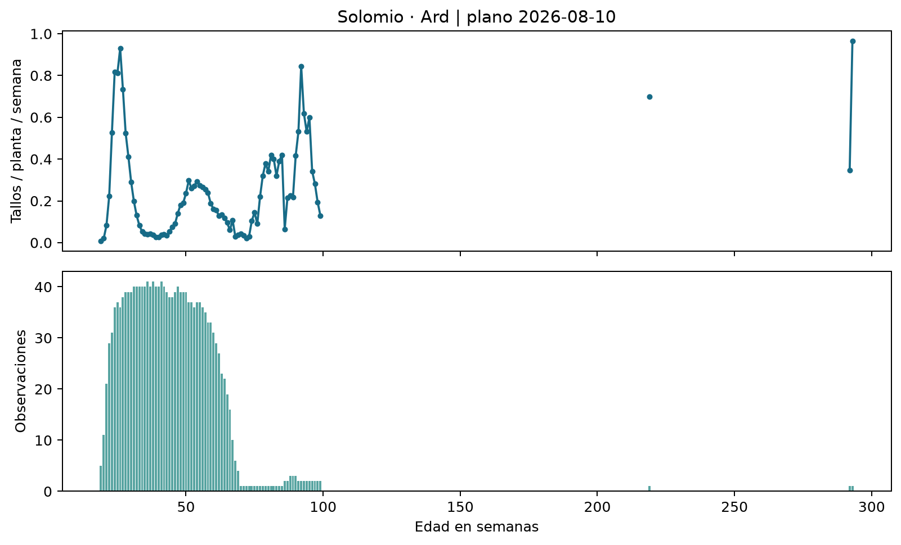

En el ejemplo de Solomio–Ard, el soporte se concentra en las edades más tempranas del tramo observado y disminuye considerablemente después. Aparecen además puntos aislados por encima de doscientas semanas, respaldados por una sola observación por edad. Su presencia exige revisar fechas y ciclos con el equipo agronómico antes de interpretar esos rendimientos como un comportamiento representativo. No se eliminan ni se unen visualmente a través de las edades ausentes. La curva hace visible así una necesidad concreta de revisión de calidad que quedaría oculta si se mostrara únicamente la proyección agregada.

La producción teórica de una semana se obtiene multiplicando las plantas de cada cohorte por el rendimiento correspondiente a su variedad y edad proyectada, y sumando los aportes cubiertos. Si una cohorte no tiene rendimiento disponible, su aporte es desconocido. La suma calculada en ese caso es parcial, aunque pueda verse como un número perfectamente válido en una tabla. Esa distinción es central para interpretar las proyecciones y para decidir cuándo el modelo puede corregirlas.

Normalizar aquí tiene dos sentidos concretos. Homologar nombres permite unir la misma combinación de producto, color y variedad sin borrar diferencias comerciales; dividir corte entre plantas expresa rendimiento en tallos por planta y permite comparar observaciones con tamaños distintos. No se escala la curva para que su suma sea uno ni se ajusta su total usando la producción futura. El recorte de extremos limita rendimientos atípicos dentro de variedad–edad; no borra ceros reportados ni completa edades ausentes. Por ejemplo ilustrativo, 600 tallos de 1.000 plantas equivalen a 0,6 tallos por planta; una cohorte de 5.000 plantas con ese rendimiento aportaría 3.000 tallos teóricos.

Una cohorte reúne las plantas del mismo plano, finca, producto, color, variedad, clave de curva y fecha de siembra. Puede sumar varias camas; no es sinónimo de cama física. Si las fechas son distintas se conservan grupos distintos, incluso cuando su edad redondeada a semanas coincide. La agregación final suma sus aportes para obtener una serie comercial y una semana objetivo.

### 3.3. Cobertura: tener una curva no equivale a poder proyectar todo

El inventario general contiene 294 archivos de planos; 293 son procesables y 292 quedan seleccionados al escoger una versión por año y semana. El plano 2022-S02 carece de la hoja Datos. La construcción produce diez semanas proyectadas por plano, con cobertura y cantidades parciales explícitas. Ese horizonte de construcción se distingue de H1–H5 del modelo, definido a partir de su fecha de emisión. [E2–E3]

Se distinguen dos problemas de cobertura. Una variedad puede no tener ninguna observación utilizable en la ventana de 78 semanas, por ausencia de historia, problemas de nombres o exclusiones de calidad. Otra puede tener curva, pero carecer del rendimiento para la edad exacta requerida. Las listas explícitas de ambos notebooks separan estos casos. Una variedad incluida en la lista de faltantes de algún plano no necesariamente carece de curva durante todo el periodo.

La cobertura también cambia al pasar de plantas a casos de pronóstico. En el EDA de la base semanal, 44.848 de 211.001 casos con producción observada tienen teoría completa: 21,25 %, frente a 17,96 % antes de la corrección. Este porcentaje cuenta combinaciones de serie, origen y horizonte; no representa porcentaje del volumen producido ni porcentaje de plantas cubiertas. Exigir que todas las cohortes de una combinación tengan curva es más estricto que informar cuánto inventario sí pudo proyectarse. [E4]

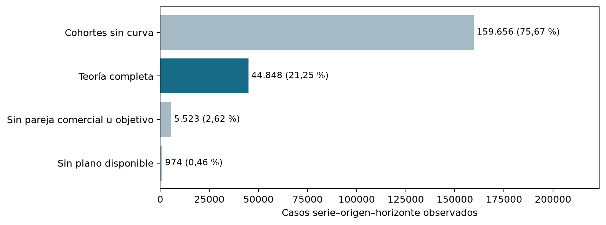

Esta evidencia modifica el diseño del sistema. Un ajuste que funcionara únicamente con teoría completa dejaría fuera gran parte de los casos observados. Se mantiene una ruta de corrección de teoría y se incorpora un respaldo basado en producción reciente. La calidad del sistema se evalúa junto con su cobertura, y las sumas parciales no se transforman artificialmente en ceros ni en pronósticos completos.

El caso DINO amarillo de GAITANA ilustra una limitación pendiente: para el objetivo del 31 de agosto de 2026, el plano de la semana 29 contiene 25 cohortes y dos sin rendimiento a edades de 9 y 16 semanas. La variedad sí tiene curva; faltan esas edades. La suma parcial es 27.916,61 tallos. Puede tratarse de edades anteriores al inicio productivo, pero el archivo sin observación no demuestra por sí solo un cero. Antes de cambiar la regla se debe verificar el inicio de corte en pilotos y distinguir ceros registrados de ausencia de datos; este estudio conserva el respaldo actual.

### 3.4. Qué muestran los cinco últimos planos

Los cinco últimos planos seleccionados corresponden a las semanas 29 a 33 de 2026; en la semana 32 se utiliza la edición actualizada. Para compararlos se alinean las mismas semanas objetivo. Comparar únicamente el primer punto de cada proyección mezclaría fechas de producción diferentes y no mediría una revisión del mismo objetivo. [E2]

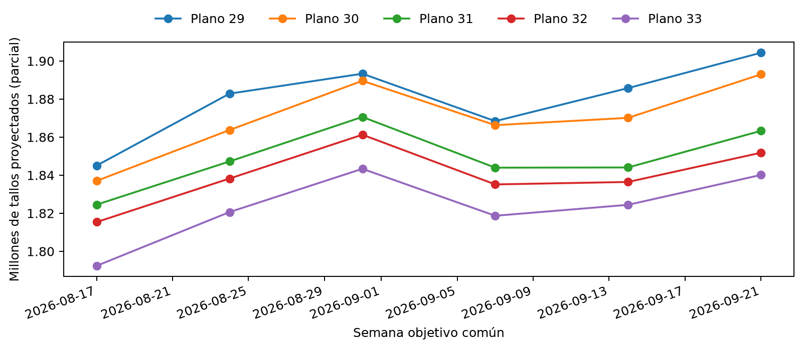

Para la semana objetivo que comienza el 17/08/2026, el total parcial pasa aproximadamente de 1.845.055 tallos en el plano 29 a 1.792.408 en el plano 33. Entre los planos 32 y 33 cambia -22.980 tallos (-1,27 %). La revisión muestra que el insumo teórico cambia conforme llega otra fotografía de inventario e historia; no demuestra que la versión más reciente sea más exacta. Para hablar de precisión se necesita emparejar cada versión con producción real comparable y controlar su cobertura.

Esto justifica conservar versiones anteriores como posibles señales del modelo. Permite preguntar si las revisiones contienen información sobre el error futuro, en lugar de asumir que toda actualización constituye una mejora. También obliga a conservar la fecha de emisión: la misma cantidad teórica tiene un significado distinto si se obtuvo una o varias semanas antes del objetivo.

### 3.5. Escala, composición y evolución de la producción real

La base de GAITANA conserva 327.991.200 tallos en 44.053 combinaciones observadas de serie y semana. Miniclavel reúne el 62,87 % del volumen y clavel el 18,47 %; juntos representan 81,34 %. Solomio aporta 8,08 % y Raffine 5,61 %. Por tanto, una métrica agregada sensible al volumen refleja en gran medida el comportamiento de miniclavel. La evaluación debe acompañarse de cortes por producto, color y variedad para reconocer dónde se concentra una mejora o una dificultad. [E3–E4]

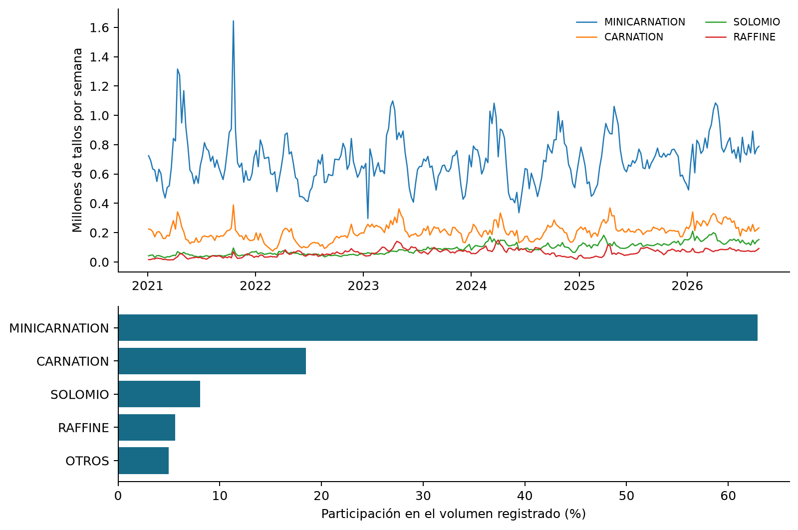

Los totales agrupados por año del lunes semanal pasan de 48,70 millones en 2022 a 61,27 millones en 2025. El periodo de 2026 contiene 35 semanas reportadas y 47,62 millones de tallos, por lo que no debe compararse como si fuera otro año completo. Las diferencias anuales pueden combinar cambios de composición, cobertura y nivel productivo. La trayectoria observada describe la fuente; no permite atribuir por sí sola crecimiento a una práctica agrícola específica.

La variación entre series también es amplia: la mediana de producción semanal observada es 3.130 tallos, mientras que el percentil 90 supera 21.076. Esta heterogeneidad explica por qué se estudian modelos compartidos con identificación comercial y por qué el error debe leerse tanto en tallos como en proporción al volumen. El análisis disponible no identifica causalmente picos por festividades o eventos comerciales; incorporarlos exigiría un calendario validado y un contraste específico.

### 3.6. Dónde se separan la teoría y la producción registrada

Sobre casos con teoría completa, el EDA define error como producción real menos teoría. Un valor negativo significa sobreestimación teórica. En H1, el error medio actualizado es -2.666 tallos y el WAPE descriptivo es 42,96 %. El signo se interpreta con la definición real menos teoría; un error negativo corresponde a sobreestimación. La curva aporta una referencia interpretable, pero trasladarla directamente al inventario no reproduce con suficiente precisión todos los cortes observados. [E4]

Este diagnóstico no se compara directamente con el WAPE del ingeniero de 2026: cambia tanto el periodo como la población evaluada. Tampoco la leve reducción del WAPE agregado entre H1 y H5 prueba que anticipar más semanas sea más fácil, porque los horizontes no contienen exactamente las mismas series. La comparación justa exige mantener las mismas observaciones dentro de cada experimento.

El resultado orienta el problema de modelado hacia el ajuste de la diferencia entre real y teoría. A la vez, la falta de cobertura exige una referencia alternativa para los demás casos. Ambas decisiones proceden del EDA: hay un error que corregir donde existe teoría completa y un problema de información donde no existe.

### 3.6.1. Qué evidencia motivó los rezagos y las tendencias

La pregunta exploratoria fue si el estado reciente de producción se relacionaba con el error posterior de la referencia. El notebook 11 calcula Spearman dentro de cada serie comercial y horizonte, sobre teoría completa y objetivos cerrados antes del 7 de julio de 2025. Requiere al menos veinte pares y resume la mediana de las correlaciones entre series, evitando que el tamaño de una variedad domine una correlación global. El error analizado es real menos teoría. [E4]

| Señal conocida al origen | Mediana de asociación H1 | H5 | Lectura metodológica |
| --- | ---: | ---: | --- |
| Producción de la semana anterior | 0,284 | −0,028 | La señal reciente se relaciona más con el error cercano. |
| Cambio entre las dos últimas semanas | 0,204 | 0,062 | Motiva probar cambios de nivel, sin asegurar utilidad en todos los horizontes. |
| Promedio de cuatro semanas | 0,135 | −0,038 | Sirve como referencia de nivel; una asociación pequeña no decide por sí sola su utilidad predictiva. |

Las cifras son asociaciones, no porcentajes de mejora. En diario 01 se estudia otra referencia: real semanal menos Media4, con datos previos al mismo corte. La tendencia de cinco días presenta medianas de 0,378 en H1 y 0,208 en H5; la de tres días, 0,171 y 0,012. Esto motiva probar detalle reciente, pero no demuestra que cinco días sea una ventana óptima: varían soporte y definición del error entre análisis. La prueba predictiva añade el bloque diario en 14 y compara errores sobre los mismos casos. [E6]

Las medias de ocho/doce semanas, dispersión, referencia de 52 semanas y conteos se plantean para representar nivel sostenido, variabilidad, estacionalidad y disponibilidad. No todas tienen una justificación individual demostrada por EDA. Su aporte se estudia por bloques: quitar memoria en 12 y añadir memoria larga en 15. Así se distingue una hipótesis razonable de una mejora observada y se evita atribuir el resultado a cada columna por separado.

### 3.7. Clima, error de volumen y desplazamiento del corte

La revisión previa utilizaba clima hasta el 28 de julio de 2026 mientras interpretaba un ajuste de agosto; por ello una importancia nula no acreditaba ausencia de influencia. La nueva limpieza conserva mediciones válidas de GAITANA hasta el 21 de septiembre. Se auditan conflictos entre ediciones, valores imposibles, huecos y frecuencia. Las observaciones son predominantemente de treinta minutos. El campo RAIN muestra cantidades que vuelven a cero entre eventos, no un contador creciente; se suman registros en las unidades originales, pendientes de confirmación con la estación. Se exige cobertura diaria suficiente antes de construir acumulados. [E15]

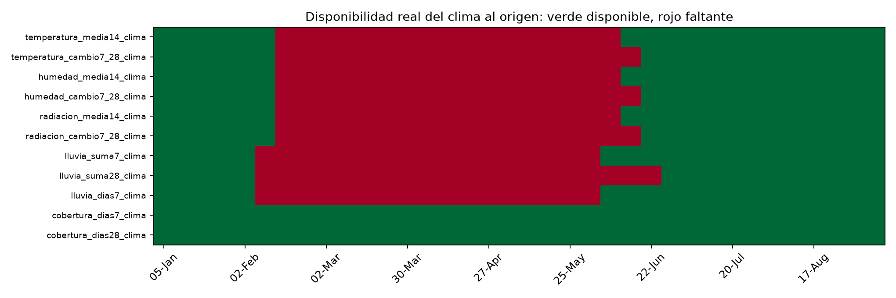

El EDA usa objetivos cerrados antes del 7 de julio de 2025. Para error de volumen estudia (real − teoría)/media4 dentro de cada serie y horizonte, con al menos veinte pares y teoría completa. Las medianas de Spearman son pequeñas y hay diferencias entre series. Las variables meteorológicas son comunes a la finca; repetirlas en varias variedades no crea observaciones meteorológicas independientes. El clima de estación no equivale necesariamente al microclima de cada invernadero.

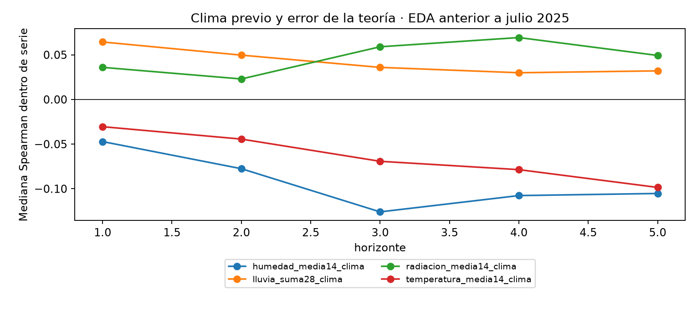

La conexión con los modelos se hace explícita en la nueva sección 1.1 de 18. Se examinan las seis variables semanales originales de 12, las nueve medias climáticas diarias añadidas en 14 y las once columnas ampliadas construidas en 18 para 19. Las primeras resumen semana anterior y cuatro semanas; las diarias, 3/5/7 días; las ampliadas incluyen media14, cambio de 7 frente a 28 días, lluvia y cobertura. No tienen idénticos umbrales de datos válidos, por lo que no se interpreta cualquier diferencia como efecto exclusivo de la longitud de ventana.

Se conserva una lectura por pares disponibles y otra con casos comunes a las 26 columnas, informando casos, orígenes y series. La segunda restringe la historia por faltantes y lluvia; no sustituye silenciosamente la primera. El análisis sigue usando solo teoría completa y no demuestra qué sucede en el respaldo. La correlación no selecciona automáticamente variables: 12 compara el clima original, 14 añade producción y clima diarios conjuntamente y 19 contrasta clima básico frente a ampliado.

La comparación común conserva entre 63,53 % y 65,24 % de los casos por horizonte. En H1 quedan 4.993 casos de 142 orígenes; 91 series cumplen los requisitos para correlación de las señales físicas. Las medianas H1 son pequeñas: temperatura semanal previa 0,033, temperatura media14 0,037, humedad media4 −0,063 y días con lluvia7 0,127. Las coberturas no tienen variación suficiente en la muestra común para estimar su asociación. Esto no demuestra ausencia de efecto climático; muestra que ampliar ventanas no produce por sí solo una relación monotónica fuerte y que comparar ventanas sin controlar disponibilidad puede cambiar la lectura.

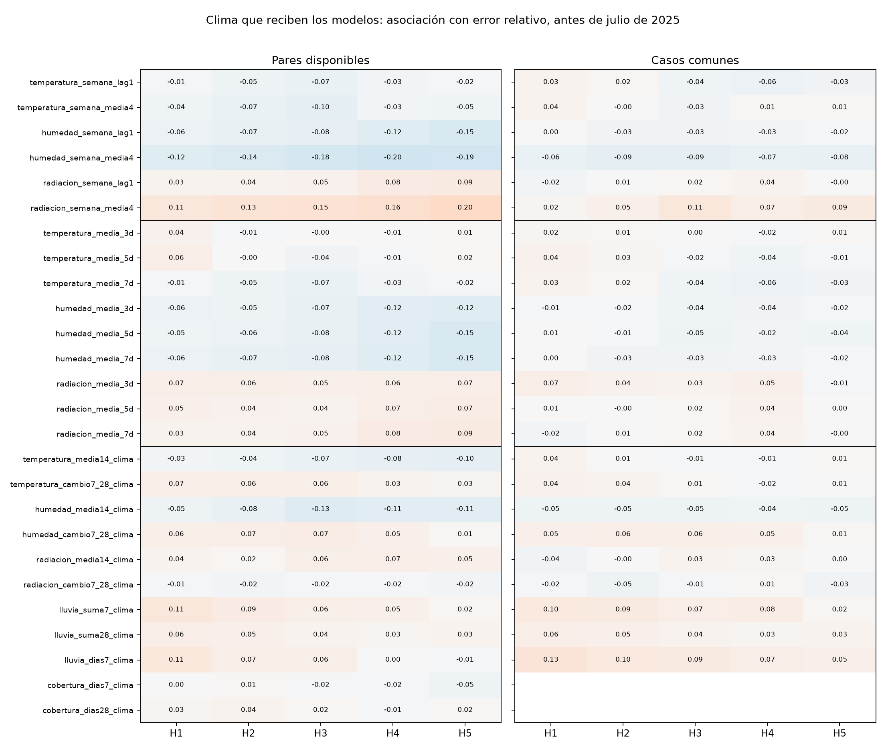

Para desplazamiento se requieren cinco horizontes con teoría y real completos. El centro de producción es la posición de semana (0–4) ponderada por tallos; centro real menos teórico positivo indica corte relativamente más tardío dentro de la ventana. No mide el corte fuera de esas cinco semanas ni prueba un retraso fisiológico: la composición de cohortes y las decisiones de corte también pueden influir. Se agregan series por origen y se separan al menos cinco semanas los orígenes analizados, evitando ventanas objetivo superpuestas.

| Señal previa | Ventanas | Spearman con desplazamiento | Intervalo exploratorio 95 % |
| --- | ---: | ---: | --- |
| temperatura_media14_clima | 40 | -0,149 | [-0,439; 0,217] |
| humedad_media14_clima | 40 | -0,100 | [-0,409; 0,263] |
| radiacion_media14_clima | 40 | 0,202 | [-0,095; 0,479] |
| lluvia_suma28_clima | 28 | -0,093 | [-0,484; 0,279] |

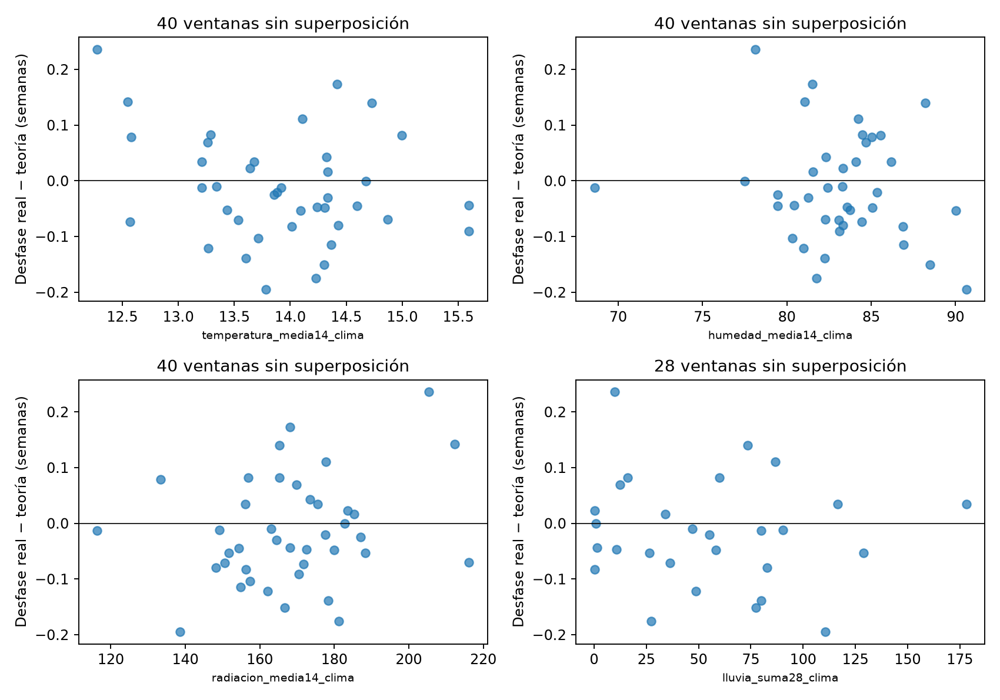

Los intervalos incluyen cero. El resultado no respalda una regla universal de adelanto o retraso por clima, pero tampoco descarta un aporte no lineal o específico por variedad. El remuestreo es exploratorio y no elimina confusión por temporada y manejo. La prueba siguiente evalúa si usar esas señales reduce error fuera del entrenamiento, con información estrictamente anterior a cada origen.

### 3.8. El calendario diario plantea una pregunta adicional

(La distribución del pronóstico entre días está en revisión y corresponde a siguientes pasos; las señales de corte diario usadas como entradas semanales sí forman parte del análisis principal.)

Al desagregar la producción aparecen 227.623 días-serie observados dentro de un calendario de 1.374.399 filas para 663 series. La suma de los cortes diarios coincide exactamente con el panel semanal por cada llave. Las filas restantes mantienen un valor faltante: construir un calendario no prueba que todas las series estuvieran activas durante todo el intervalo. [E6]

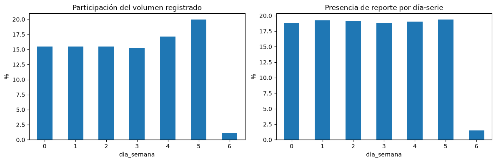

En el agregado de la finca, los sábados reúnen 65,54 millones de tallos reportados y los domingos 3,65 millones. Además, hay reporte dominical en sólo treinta fechas del periodo, frente a varios centenares para los demás días. El patrón muestra que un reparto uniforme de una séptima parte por día desconoce la distribución registrada. No permite concluir que la producción física del domingo sea siempre nula: calendario de corte y calendario de registro pueden diferir y requieren validación operativa.

El total semanal también puede ocultar cambios recientes. Dos series con un total parecido en la semana anterior pueden llegar al lunes con trayectorias distintas en los últimos tres o cinco días. De ahí surge la extensión con medias, sumas, tendencia y antigüedad del último corte. Las ventanas siguen días de calendario y se acompañan de conteos observados; no toman simplemente las últimas filas disponibles ignorando huecos.

### 3.9. Del hallazgo a la decisión metodológica

| Hallazgo del EDA | Decisión que orienta | Qué debe comprobar el modelo |
| --- | --- | --- |
| Los planos son fotografías y cambian entre versiones | Conservar origen, objetivo y versión | Si la historia de revisiones aporta fuera del ajuste inicial |
| Hay variedades sin curva y edades sin soporte | Marcar cobertura y usar respaldo explícito | Precisión y cobertura del sistema completo |
| La teoría presenta diferencias sistemáticas con lo registrado | Aprender una corrección | Mejora frente a referencias sobre casos comunes |
| El volumen se concentra y las series tienen escalas diferentes | Desglosar métricas por segmento | Que el agregado no oculte deterioros relevantes |
| La memoria reciente se asocia más con el error cercano | Añadir rezagos y tendencias de corte | Aporte por horizonte, sin asumir causalidad |
| El registro diario no sigue una distribución uniforme | Comparar perfiles y modelos diarios | Error diario y coherencia con la semana por separado |

## 4. Diseño del sistema de pronóstico

### 4.1. Integración, calendario y disponibilidad

La unidad semanal es finca, producto, color, variedad y semana. La base de pronóstico agrega origen y horizonte: una semana objetivo puede aparecer varias veces porque fue anticipada en fechas distintas. Por eso sus cantidades no se suman como inventario producido. Las proyecciones ya calculadas se incorporan como insumo; los modelos de ajuste no vuelven a consultar plantas ni curvas para reconstruirlas. [E3]

H1 corresponde a la semana que comienza el lunes de emisión y H5 a la que comienza cuatro semanas después. Sólo se usan semanas cerradas al entrenar. Las variables diarias se desplazan un día y las predicciones de los siete días de H1 se congelan al lunes, sin actualizarse con lo ocurrido dentro de esa semana. Se supone que los reportes pasados ya están disponibles; su latencia real debe confirmarse. AL1 aporta una referencia de disponibilidad supuesta para los planos, no una prueba de publicación.

Las homologaciones conservan la identidad comercial y no fuerzan coincidencias ambiguas. Los movimientos legítimos de producción se mantienen, los objetivos ausentes no se imputan y los parámetros de imputación de predictores se estiman con entrenamiento. Una prueba que modifica producción futura verifica que las variables anteriores al origen permanezcan iguales. Estos controles hacen revisable el significado de cada caso.

### 4.1.1. Cómo leer la base analítica consolidada

La base común tiene 621.195 filas y 47 columnas; incluye también casos sin objetivo observado o sin historia suficiente. No equivale al conjunto de entrenamiento ni a los 15.838 casos del benchmark. Cada fila pregunta cuántos tallos producirá una finca/producto/color/variedad en una semana objetivo, con información disponible desde un origen. El anexo de diccionario agrupa las 47 columnas; las etapas posteriores añaden entradas explícitas.

En DINO amarillo de GAITANA, origen 3 de agosto de 2026 y H5 significan pronosticar del 31 de agosto al 6 de septiembre. La última semana histórica empieza el 27 de julio y reporta 19.202 tallos; Media4 es 22.250,75. Los 18.970 tallos en y corresponden al resultado observado después. La teoría es parcial por dos cohortes sin cobertura y, por tanto, teoria_modelo está vacío. La fila sigue siendo admisible porque tiene Media4 y 213 semanas históricas reportadas; se utiliza la ruta de respaldo. Admisible no significa teoría completa, pertenencia a test ni resultado ya conocido.

La teoría previa no es el horizonte anterior: es lo que un plano anterior calculaba para la misma semana objetivo. En este caso, el plano seleccionado del 13 de julio llega al objetivo en su horizonte teórico 7; los dos anteriores, en 8 y 9. El generador produce diez semanas, mientras el modelo evalúa H1–H5 desde otro origen. Las versiones anteriores sí existían, pero estaban incompletas y no se habilitaron como teorías previas. Los vacíos no representan cero tallos.

### 4.2. Modelo semanal y señales recientes

Cuando hay teoría completa, el sistema aprende la diferencia entre producción real y teoría. En los otros casos utiliza una corrección de la media de producción reciente de cuatro semanas. Los modelos de boosting comparten información entre series e incorporan identificación comercial, horizonte, memoria semanal y los bloques de clima y teoría definidos en los notebooks. Las comparaciones de bloques permiten estudiar su aporte sin confundir una muestra diferente con una mejora. [E5]

La extensión incorpora 28 variables diarias: medias, sumas y conteos de corte en ventanas de 3, 5, 7 y 14 días; dispersión, rezagos, media exponencial, tendencias y días desde el último corte; y medias pasadas de temperatura, humedad y radiación. También se evalúa una corrección relativa. Una variante de pérdida absoluta se ensayó después de inspeccionar resultados y se identifica como exploratoria; además cambia la forma de combinar las rutas, por lo que su resultado no aísla únicamente el efecto de la función de pérdida.

Los candidatos semanales usan parámetros fijos de boosting: tasa de aprendizaje 0,08, 80 iteraciones, hasta 15 hojas, mínimo 40 observaciones por hoja, regularización L2 de 1 y semilla 42. El detalle reproducible permanece en los notebooks. El reentrenamiento mensual permite comparar los candidatos sobre los mismos orígenes de 2026, sin ajustar cada combinación hasta obtener un resultado favorable.

El algoritmo principal es HistGradientBoostingRegressor, implementado en scikit-learn. Cada árbol aprende condiciones sobre las entradas; los árboles se incorporan por etapas para reducir el error que queda. Puede representar relaciones no lineales e interacciones, por ejemplo respuestas distintas a una tendencia en horizontes cercanos y lejanos. La variante por histogramas agrupa valores numéricos para buscar divisiones eficientemente. Se compara con referencias simples y Ridge; no se justifica su elección únicamente por complejidad.

El objetivo aprendido es una corrección en tallos: real menos teoría, o real menos Media4 en el respaldo. La predicción final suma referencia y corrección estimada, con mínimo cero. Como ejemplo ilustrativo, una teoría de 28.000 y una corrección estimada de −3.500 producen un pronóstico de 24.500 tallos. El modelo aprende la corrección con resultados históricos, pero no conoce la producción objetivo futura al emitirla. Ridge estima esa corrección con una combinación lineal regularizada; boosting suma aportes de árboles. Ambos se evalúan fuera del entrenamiento.

### 4.2.1. Referencias y experimentos iniciales: qué significa cada nombre

| Nombre de resultados (12) | Algoritmo y referencia | Información y pregunta |
| --- | --- | --- |
| Ultimo_valor | Regla: última semana real | ¿Superamos repetir el nivel más reciente? |
| Media4 | Regla: promedio de cuatro semanas | ¿Superamos una referencia suavizada? |
| Teoria_sin_ajuste | Proyección ya calculada | ¿Cuánto error existe antes de corregirla? |
| Ajuste_media4_sin_planos | Boosting sobre Media4 | Producción histórica, calendario, identidad y clima; no recibe teoría. |
| Modelo_teorico | Boosting sobre teoría | Añade teoría y su desvío frente a Media4; usa memoria real y clima. |
| Teorico_sin_memoria | Boosting sobre teoría | Retira producción histórica y desvío: prueba el aporte del bloque de memoria. |
| Teorico_sin_clima | Boosting sobre teoría | Retira las seis variables climáticas originales. |
| Ridge_ajuste_teoria | Regresión Ridge sobre teoría | Mismas entradas del teórico; contrasta una corrección lineal regularizada. |
| Modelo_teorico_historia | Boosting sobre teoría | Añade las dos versiones previas y revisión para la misma semana objetivo. |
| Sistema_teoria_con_respaldo | Selección entre dos ajustes boosting | Teoría completa si existe; ajuste de Media4 si falta. No promedia ambas rutas. |

Memoria significa producción real histórica, no versiones anteriores de proyecciones. Sin memoria sigue entrenándose con ejemplos históricos; simplemente no recibe ese bloque como entrada. Identidad comercial son producto, color y variedad. Finca identifica la serie y las uniones, pero no es una categoría entregada al algoritmo del 12.

| Bloque de entradas de Modelo_teorico | Columnas | Cantidad |
| --- | --- | ---: |
| Identidad y calendario | producto, color, variedad; horizonte, semana_seno, semana_coseno | 6 |
| Memoria real | produccion_lag1/2/3, media_4/8, desv_4, tendencia_4_8, cambio_reciente, produccion_52 | 9 |
| Clima original | Temperatura, humedad y radiación: semana anterior y media4 | 6 |
| Teoría | teoria_modelo, antiguedad_curva, desviacion_reciente_teoria | 3 |

El teórico recibe 24 columnas originales; sin memoria recibe 14, sin clima 18 y con historia 27. Ridge recibe las mismas 24; el ajuste de Media4 recibe 21. La codificación convierte categorías en indicadores y la imputación puede añadir indicadores de ausencia, por lo que estos conteos no equivalen a la dimensión final del algoritmo. Todo se aprende dentro de train; Ridge además estandariza las variables numéricas. No se entregan y, nombres de archivos, llaves de unión ni banderas de cobertura como predictores en estos ajustes. Las fechas definen cortes y calendario; la cobertura determina la ruta. Recibir una variable no prueba que sea útil.

Los nueve métodos iniciales se puntúan en casos comunes con teoría completa. Las ablaciones mantienen el entrenamiento teórico y sus parámetros, cambiando un bloque. En cambio, el ajuste Media4 aprende con todos sus casos admisibles; compararlo con el teórico cambia también la cobertura de entrenamiento. El sistema con respaldo se evalúa aparte sobre todos los casos admisibles.

### 4.2.2. De información semanal a tendencias diarias para pronosticar semanas

El experimento 13 enfrenta el sistema inicial al ingeniero; el 14 conserva boosting y añade 28 entradas, sin convertir todavía la tarea en pronóstico diario. Para un mismo total semanal, una trayectoria de corte creciente puede contener información distinta de una decreciente. Se prueba esa hipótesis, no se impone una corrección automática por tendencia.

| Nuevas entradas en 14 | Construcción y significado |
| --- | --- |
| corte_media, corte_suma y corte_dias, cada una en 3/5/7/14 días (12) | Nivel, volumen observado y cantidad de días con dato. Los faltantes no se sustituyen por cero. |
| corte_std_7d; corte_lag1d; corte_lag7d (3) | Dispersión de siete días, valor del día anterior y de siete días atrás. |
| corte_ema_5d (1) | Promedio exponencial con mayor peso reciente; conserva influencia de días anteriores, no trunca exactamente a cinco días. |
| corte_tendencia_3d/5d (2) | Media de los últimos 3/5 días menos media del bloque inmediatamente anterior de igual longitud. |
| dias_desde_corte (1) | Días desde el último valor reportado, incluso cero; no necesariamente desde el último corte positivo. |
| Temperatura/humedad/radiación media en 3/5/7 días (9) | Nueve resúmenes meteorológicos previos al origen. |

Las medias y sumas productivas admiten ventanas parciales y se acompañan de conteos. Todas excluyen el día del origen. La variante aditiva conserva las dos rutas; la alternativa relativa usa el mismo boosting para aprender log(1+real) menos log(1+Media4), invierte la transformación y limita a cero. Otra variante exploratoria cambia pérdida a error absoluto y usa una ruta conjunta sobre Media4, con teoría como predictor: no aísla exclusivamente el efecto de la pérdida.

### 4.2.3. Experimentos acotados después de corregir calidad

El experimento 15 documenta la corrección de calidad y los cambios de arquitectura. Su referencia anterior a calidad conserva el clima de aquella ejecución: tras actualizar la fuente, ese contraste ya no aísla sólo calidad. Dentro de los candidatos recalculados mantiene el clima común; luego separa modelos para H1–H2 y H3–H5, añade memoria de doce semanas, dispersión y conteos, y finalmente añade historia de proyecciones a las rutas teórica y de respaldo. Las medias de cuatro/ocho semanas y la referencia de un año ya existían y no se presentan como variables nuevas. Cada etapa conserva la anterior y añade un bloque. [E10]

La combinación sencilla usa pesos de 0, 0,25, 0,50, 0,75 o 1 sobre el modelo y una referencia de media4 o teoría con respaldo. Los pesos por grupo de horizontes se eligen mediante predicciones de noviembre–diciembre de 2025, con entrenamiento anterior a cada origen y objetivos cerrados antes de enero de 2026. Se mantienen fijos al evaluar 2026. El periodo 2026 continúa siendo desarrollo retrospectivo y no selecciona esos pesos.

### 4.2.4. Prueba acotada del clima y de la procedencia de curvas

El experimento 19 mantiene HistGradientBoostingRegressor, parámetros, memoria larga, separación H1–H2/H3–H5 y rutas teórica/respaldo. Compara retirar todo el clima, usar el clima básico actualizado, añadir señales de catorce/veintiocho días y lluvia, y cambiar la referencia a la curva atribuida a GAITANA manteniendo el mismo clima ampliado. La última comparación afecta tanto referencia como cobertura; se desglosa por rutas y se compara la teoría cruda sobre casos completos para ambas alternativas. [E16]

La selección utiliza el menor WAPE de noviembre–diciembre de 2025, con objetivos cerrados antes de enero de 2026. Se conserva al evaluar 2026. Los modelos se reentrenan mensualmente usando sólo semanas objetivo terminadas antes del corte; imputación y codificación se ajustan en train. Los predictores climáticos terminan antes del lunes de emisión. No se usa clima futuro observado ni pronóstico meteorológico externo. Las pruebas de perturbación del futuro comprueban que no cambien las variables pasadas.

Actualizar clima básico permite medir el efecto de completar la fuente manteniendo la arquitectura anterior. Añadir el bloque ampliado mide una pregunta distinta. La historia previa al arreglo de calidad de 15 se conserva como referencia, pero su contraste con modelos de clima nuevo ya no aísla sólo calidad de curvas. Ningún periodo examinado durante el desarrollo se presenta como prueba prospectiva intacta.

La validación anterior a 2026 produce esta comparación; no es el test frente al ingeniero:

| Método | Casos | MAE (tallos) | WAPE | Sesgo |
| --- | ---: | ---: | ---: | ---: |
| Boosting sin clima | 3.548 | 2.054,06 | 21,79 % | 1,46 % |
| Boosting con clima básico actualizado | 3.548 | 2.070,30 | 21,96 % | 2,29 % |
| Boosting con clima ampliado y lluvia | 3.548 | 2.090,09 | 22,17 % | 3,43 % |
| Clima ampliado + curva atribuida a GAITANA | 3.548 | 2.201,03 | 23,35 % | 4,53 % |

Una diferencia pequeña entre candidatos en estos dos meses no acredita superioridad estable. Se conserva la elección para evitar escoger de nuevo mirando el resultado de 2026.

### 4.2.5. Secuencia temporal de entrenamiento, validación y evaluación

En 12 se fijan cortes el 7 de julio de 2025, 5 de enero y 4 de mayo de 2026, con ocho semanas de orígenes de evaluación por corte. Cada entrenamiento exige semana_objetivo + siete días menor o igual al corte: no basta con que el origen sea antiguo si su resultado aún no había cerrado. No hay división aleatoria. En 13–19 se reentrena al primer origen de cada mes, conservando los mismos parámetros y el pasado disponible.

Para pesos del 15 y selección del 19 se usan predicciones temporales de noviembre–diciembre de 2025, con objetivos terminados antes de enero de 2026. Luego se evalúa 2026 sin cambiar la elección por el ingeniero. Durante esa evaluación mensual pueden entrar al entrenamiento resultados de meses anteriores de 2026 que ya cerraron: es actualización temporal, no uso de los objetivos del mes que se está evaluando. Los errores train y test se comparan por el mismo ajuste; no se interpreta el train del último mes como si fuera el entrenamiento fijo de todo el año. Como esos periodos se revisaron durante desarrollo, aún se requiere una evaluación prospectiva nueva.

### 4.3. Comparación con el ingeniero

La evaluación principal exige misma finca, producto, color, variedad, origen, objetivo y horizonte, además de un archivo del ingeniero no posterior al origen bajo la regla nominal adoptada. Los emparejamientos recuperados por color, los archivos posteriores y los casos sin pareja se separan. El pronóstico del ingeniero se utiliza para evaluar; no alimenta los modelos candidatos. [E5]

Se informa MAE en tallos, RMSE, WAPE y sesgo, con cortes por horizonte y segmento. El WAPE es la suma de errores absolutos dividida por la suma de producción real: un 20 % no significa 80 % de casos acertados. En las tablas vigentes de 19 y diario 05, sesgo = predicción menos real: positivo indica sobreestimar y negativo subestimar. Su versión porcentual divide la suma de errores firmados por la suma real y multiplica por cien. Los diagnósticos históricos de teoría y algunos notebooks anteriores usan real menos predicción; sus signos no se comparan sin invertirlos. El remuestreo por semana objetivo aporta intervalos exploratorios, sin convertir retrospectivamente estos periodos en una prueba independiente intacta.

### 4.4. Pronóstico diario autónomo y distribución del total semanal

(En revisión: desarrollo preliminar y siguientes pasos.)

El modelo diario autónomo aprende el corte de cada día con historia de producción, clima pasado y calendario, sin recibir el pronóstico semanal actual. Las variantes reconciliadas calculan pesos no negativos para los siete días, los normalizan para que sumen uno y los multiplican por el pronóstico semanal. Se comparan reparto uniforme, perfil de volumen registrado en las ocho semanas previas y perfil de boosting ponderado por frecuencia histórica de reporte. Este último representa el volumen registrado esperado, no una afirmación de producción física cero en días ausentes. [E7]

La evaluación separa error diario, distribución relativa y conservación del total semanal. Se puntúan días con reporte y se informa la cantidad asignada a días sin registro como diagnóstico. El total semanal real se utiliza sólo al analizar posteriormente la forma de la distribución, nunca como entrada de un pronóstico supuestamente perfecto.

Como contraste de series de tiempo se prueban SARIMA (1,0,1)×(0,1,1,7) y SARIMAX con el mismo orden y clima rezagado siete días, sobre log(1+tallos), con 365 días de historia. Ese rezago permite conocer al lunes las variables climáticas de los siete días futuros sin usar clima futuro realizado. El piloto considera las tres series con mayor volumen de 2025 y al menos 120 días reportados, y el primer origen de cada mes de enero a agosto de 2026. Se audita convergencia y se comparan todos los métodos en los mismos días disponibles. [E8]

## 5. Resultados: qué mejoró y dónde persisten las dificultades

### Recorrido de resultados antes de la selección vigente

Las comparaciones se leen por etapa, no como una sola tabla con poblaciones intercambiables. En 12, los mismos 1.834 casos completos dan los resultados siguientes; son tres bloques temporales, no todo el benchmark de 2026. [E5]

| Método | WAPE | Qué representa |
| --- | ---: | --- |
| Teoria_sin_ajuste | 33,97 % | Teoría cruda sin corrección aprendida. |
| Teorico_sin_memoria | 25,46 % | Boosting teórico sin historial de producción real. |
| Media4 | 24,39 % | Promedio reciente sin corrección. |
| Ridge_ajuste_teoria | 22,38 % | Corrección lineal regularizada de teoría. |
| Ultimo_valor | 22,15 % | Repetir la última producción semanal. |
| Ajuste_media4_sin_planos | 22,05 % | Boosting que corrige Media4 sin teoría. |
| Modelo_teorico | 21,68 % | Boosting teórico con memoria y clima. |
| Modelo_teorico_historia | 21,46 % | El anterior más versiones previas. |
| Teorico_sin_clima | 21,31 % | Boosting teórico con memoria, sin clima. |

Añadir memoria reduce el WAPE 3,78 puntos frente a retirarla. El clima original no mejora esa comparación; historia aporta 0,22 puntos y su intervalo exploratorio incluye cero. No se declara automáticamente ganador operativo. Sobre los 14.108 casos admisibles, incluidos los que carecen de teoría completa, sistema con respaldo 21,11 % frente a ajuste Media4 21,14 %: el beneficio global es pequeño, aproximadamente 0,04 puntos. La cobertura completa por corte es 20,84 %, 12,46 % y 5,45 %.

El recorrido posterior conserva 15.838 casos comunes del ingeniero. Todos los candidatos aprendidos de la tabla son variantes del mismo boosting; las diferencias están en entradas, rutas, objetivos o separación de horizontes. Las cifras corresponden a sus ejecuciones actuales, no a una promesa de mejora estable.

| Etapa y método | WAPE | Cambio probado y decisión |
| --- | ---: | --- |
| 13: sistema inicial | 20,36 % | Ajuste teórico y respaldo; aún no supera al ingeniero en conjunto. |
| 14: sistema con información diaria | 20,03 % | Añade 28 variables; mejora 0,32 puntos frente al inicial, sin aislar cada señal. |
| 14: ajuste relativo diario | 20,68 % | Cambia a corrección logarítmica de Media4; no mejora la referencia aditiva. |
| 14: boosting con pérdida absoluta | 20,03 % | También cambia rutas; casi empata, queda como exploratorio. |
| 15: Separado | 19,67 % | Ajustes distintos para H1–H2 y H3–H5, con las mismas entradas. |
| 15: Memoria_larga | 19,57 % | Añade media12, desv8/12, reportes4/8/12 y tendencia4_12: siete columnas. |
| 15: Revisiones / Combinacion | 19,62 % | Añade historia; la validación asigna peso 1 al modelo, por eso la combinación coincide. |
| Ingeniero | 19,74 % | Estimados registrados de esos mismos casos, no algoritmo entrenado en este proyecto. |

Separar horizontes permite relaciones diferentes según anticipación; no equivale a cinco modelos independientes, uno por horizonte. Memoria larga añade contexto al cambio reciente y resulta el menor WAPE retrospectivo del 15. Las revisiones no mejoran esa variante. El contraste histórico Antes_calidad conserva otro clima y no permite atribuir su diferencia solo a recuperación de curvas. La selección vigente se realiza después en 19 con validación anterior a 2026, como se describe en 4.2.4.

### 5.1. Precisión semanal: efecto del clima y comparación con el ingeniero

La configuración semanal seleccionada no utiliza variables meteorológicas. El componente diario conserva temperatura, humedad y radiación en sus pesos; son etapas distintas.

Se mantienen 15.838 casos principales con las mismas llaves, orígenes y objetivos. El ingeniero no alimenta los modelos. La alternativa seleccionada por validación previa es **Boosting sin clima**; no se reemplaza por otro candidato mirando 2026. [E16]

| Método | Casos | MAE (tallos) | WAPE | Sesgo |
| --- | ---: | ---: | ---: | ---: |
| Memoria larga antes de actualizar clima | 15.838 | 2.512,65 | 19,59 % | -3,54 % |
| Boosting con clima ampliado y lluvia | 15.838 | 2.496,43 | 19,46 % | -2,96 % |
| Boosting con clima básico actualizado | 15.838 | 2.510,25 | 19,57 % | -3,58 % |
| Clima ampliado + curva atribuida a GAITANA | 15.838 | 2.515,81 | 19,61 % | -2,76 % |
| Boosting sin clima | 15.838 | 2.496,17 | 19,46 % | -2,42 % |
| Ingeniero | 15.838 | 2.531,72 | 19,74 % | -9,75 % |

| Horizonte | Casos | WAPE anterior | WAPE actual | WAPE ingeniero | Ventaja actual vs. ingeniero (pp) |
| --- | ---: | ---: | ---: | ---: | ---: |
| H1 | 3.413 | 15,68 % | 15,66 % | 17,09 % | 1,43 |
| H2 | 3.289 | 17,56 % | 17,37 % | 19,28 % | 1,91 |
| H3 | 3.166 | 20,39 % | 20,39 % | 20,32 % | -0,07 |
| H4 | 3.045 | 22,14 % | 21,96 % | 20,91 % | -1,04 |
| H5 | 2.925 | 22,77 % | 22,50 % | 21,40 % | -1,10 |
| Conjunto | 15.838 | 19,59 % | 19,46 % | 19,74 % | 0,28 |

| Horizonte | Sesgo anterior | Sesgo actual | Sesgo ingeniero |
| --- | ---: | ---: | ---: |
| H1 | -1,71 % | -1,23 % | -7,56 % |
| H2 | -3,41 % | -2,40 % | -8,17 % |
| H3 | -3,89 % | -2,70 % | -9,46 % |
| H4 | -4,63 % | -3,27 % | -11,32 % |
| H5 | -4,23 % | -2,63 % | -12,63 % |
| Conjunto | -3,54 % | -2,42 % | -9,75 % |

Sesgo = 100 × suma(predicción − real) / suma(real). Positivo: sobreestimación; negativo: subestimación. Cero no implica poco error: errores opuestos pueden compensarse. WAPE y sesgo se calculan sobre los mismos casos por horizonte.

H1 por separado, sobre los mismos 3.413 casos:

| H1: método | WAPE | MAE (tallos) | Sesgo medio (tallos) | Sesgo (%) |
| --- | ---: | ---: | ---: | ---: |
| Anterior | 15,68 % | 1.980,53 | -216,37 | -1,71 % |
| Actual: boosting sin clima | 15,66 % | 1.978,16 | -155,84 | -1,23 % |
| Ingeniero | 17,09 % | 2.158,89 | -955,34 | -7,56 % |

En H1, la ventaja frente al ingeniero es 1,43 puntos de WAPE y el sesgo es más cercano a cero. No equivale a ganar en todos los horizontes.

La ventaja conjunta de la selección frente al ingeniero es 0,28 puntos de WAPE (positivo favorece al modelo), con intervalo exploratorio [-1,27; 1,72]. Se conserva el desglose por horizonte y mes: una ventaja acumulada no implica ganar todos los periodos. El WAPE mide error absoluto respecto al volumen total, no porcentaje de casos acertados.

El conjunto agrega casos de pronóstico. Una misma semana objetivo puede aparecer desde distintos orígenes y horizontes; su denominador no representa producción física única de la finca. La comparación por horizonte evita esconder diferencias de anticipación.

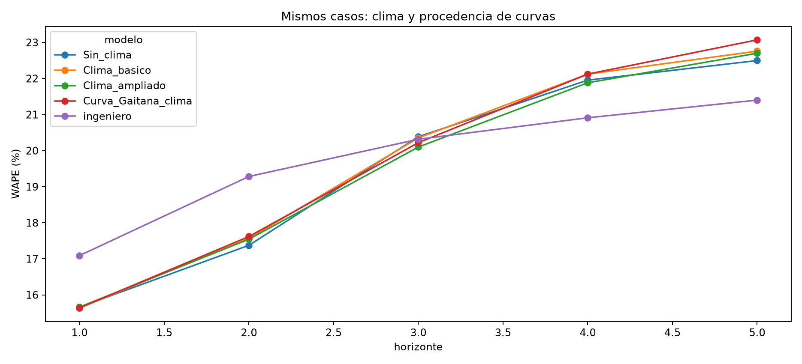

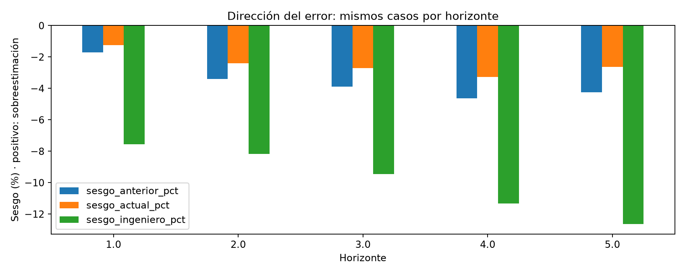

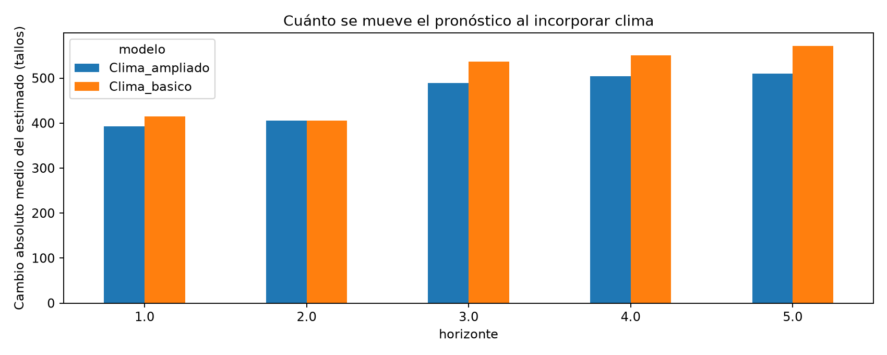

Los Excel conservan cambios medios con signo, magnitud absoluta y mejora de WAPE por horizonte. Las hojas Rutas_curvas y Teorias_mismos_casos permiten separar los casos que mantienen teoría completa de los que cambian al respaldo. Una mejora por restringir pilotos no certifica que la curva represente mejor la fisiología; puede proceder de cambiar de ruta. Las atribuciones desconocidas no se fuerzan.

### 5.2. Precisión diaria y coherencia semanal con el clima actualizado

(En revisión: desarrollo preliminar y siguientes pasos.)

El experimento 05 usa la alternativa semanal elegida en 2025 y mantiene los pesos diarios de 02, recalculados con temperatura, humedad y radiación actualizadas. El bloque adicional de lluvia influye en el total semanal sólo si lo utiliza la alternativa seleccionada; no se añade directamente al estimador de pesos diarios. Se emiten siete días al lunes sin usar reportes de la semana en curso. [E17]

| Método | Casos | MAE (tallos) | WAPE | Sesgo |
| --- | ---: | ---: | ---: | ---: |
| Diario autónomo antes de actualizar clima | 22.973 | 543,76 | 26,76 % | -7,23 % |
| Boosting reconciliado · selección semanal | 22.973 | 554,07 | 27,27 % | -5,91 % |
| Boosting diario autónomo | 22.973 | 542,84 | 26,72 % | -7,11 % |
| Boosting reconciliado · memoria actualizada | 22.973 | 557,45 | 27,44 % | -6,21 % |
| Perfil histórico · selección semanal | 22.973 | 562,66 | 27,69 % | -5,48 % |
| Perfil histórico · memoria actualizada | 22.973 | 565,88 | 27,85 % | -5,78 % |
| Diario reconciliado antes de actualizar clima | 22.973 | 557,78 | 27,45 % | -6,21 % |
| Uniforme · selección semanal | 22.973 | 584,97 | 28,79 % | -16,81 % |
| Uniforme · memoria actualizada | 22.973 | 589,48 | 29,01 % | -17,03 % |

El WAPE del boosting reconciliado al candidato es 27,27 %; el autónomo obtiene 26,72 %. Como referencia histórica, el reconciliado con memoria antes de esta actualización obtenía 27,45 %. Esta comparación histórica incluye actualizar el componente diario y el total; el contraste entre repartos actuales mantiene fijos pesos y días para aislar el cambio de total. Todos los repartos coherentes suman exactamente su total semanal.

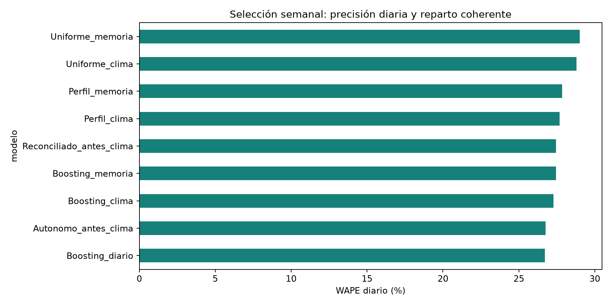

La sensibilidad de semanas con siete reportes conserva 274 semanas-serie: uniforme 24,88 %, autónomo 24,73 %, boosting reconciliado 33,33 %. Su composición difiere de la muestra general. No se puede usar la completitud futura para elegir método al lunes. Las ausencias permanecen faltantes y no certifican corte cero; no existe aquí un benchmark diario del ingeniero ni un umbral operativo validado.

### 5.3. Piloto SARIMA/SARIMAX

(En revisión: desarrollo preliminar y siguientes pasos.)

Se mantienen las tres series elegidas por volumen de 2025, los órdenes SARIMA (1,0,1)×(0,1,1,7), clima rezagado siete días en SARIMAX y auditoría de convergencia. El clima se actualiza, no se cambian los órdenes buscando mejorar 2026. El nuevo total sólo modifica la reconciliación. La tabla utiliza días comunes a todos los métodos; no se compara directamente con el WAPE diario de toda la finca. [E8, E17]

| Método | Casos | MAE (tallos) | WAPE | Sesgo |
| --- | ---: | ---: | ---: | ---: |
| Boosting reconciliado · selección semanal | 135 | 2.452,89 | 27,13 % | -11,67 % |
| Boosting diario autónomo | 135 | 2.791,97 | 30,88 % | -12,53 % |
| Perfil histórico · selección semanal | 135 | 2.443,59 | 27,03 % | -11,88 % |
| SARIMA | 135 | 2.252,11 | 24,91 % | -2,61 % |
| SARIMAX | 135 | 2.217,70 | 24,53 % | -2,98 % |
| SARIMAX_clima | 135 | 2.700,66 | 29,87 % | -21,89 % |
| SARIMA_clima | 135 | 2.685,61 | 29,70 % | -21,77 % |
| Semana_anterior | 135 | 2.839,95 | 31,41 % | -2,87 % |
| Uniforme · selección semanal | 135 | 2.676,18 | 29,60 % | -22,25 % |

### 5.4. Interpretación de variables del modelo seleccionado

El notebook 16 reconstruye el ajuste de agosto de la selección de 19 y verifica sus predicciones. Mide aumento de WAPE al permutar bloques y variables, incluyendo la referencia sumada al corrector. Cinco repeticiones, semilla fija; la dispersión no es un intervalo de confianza. No son valores SHAP, porcentajes de producción ni efectos causales. El gráfico anterior que mostraba clima nulo con datos faltantes queda sustituido por esta ejecución con cobertura actualizada. [E12]

Como la selección es Sin_clima, no aparecen variables meteorológicas en sus importancias: no forman parte de ese modelo. Esto no es una importancia climática estimada de cero. Su aporte adicional se evalúa con las comparaciones controladas de 19.

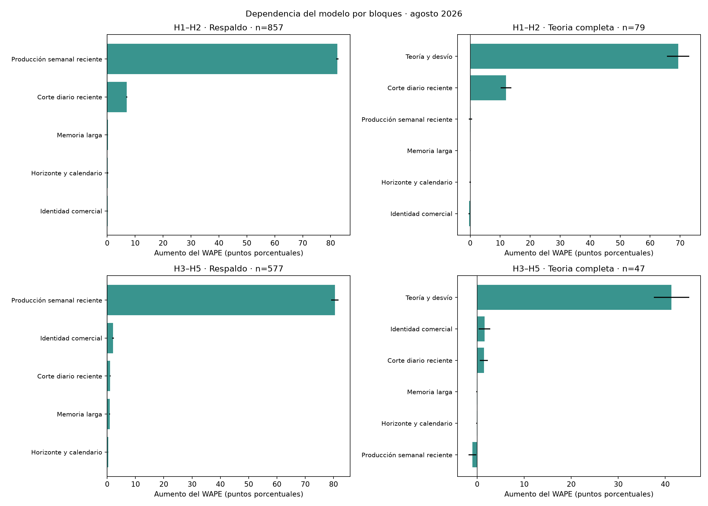

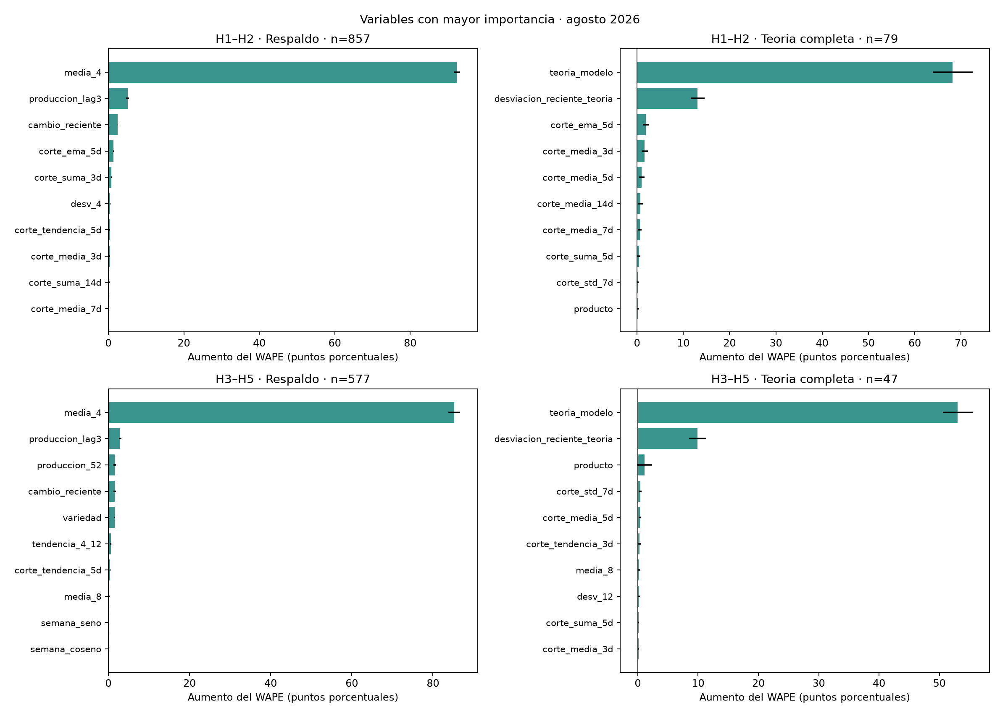

En H1_H2/Respaldo, permutar Producción semanal reciente aumenta el WAPE en 82,43 puntos (857 casos). En H3_H5/Respaldo, permutar Producción semanal reciente aumenta el WAPE en 80,50 puntos (577 casos). En H1_H2/Teoria_completa, permutar Teoría y desvío aumenta el WAPE en 69,37 puntos (79 casos). En H3_H5/Teoria_completa, permutar Teoría y desvío aumenta el WAPE en 41,34 puntos (47 casos). En H1_H2/Teoria_completa, permutar Corte diario reciente aumenta el WAPE en 11,99 puntos (79 casos). En H1_H2/Respaldo, permutar Corte diario reciente aumenta el WAPE en 7,02 puntos (857 casos). En H3_H5/Respaldo, permutar Identidad comercial aumenta el WAPE en 2,09 puntos (577 casos). En H3_H5/Teoria_completa, permutar Identidad comercial aumenta el WAPE en 1,56 puntos (47 casos). 

Las variables correlacionadas pueden sustituirse entre sí y permutar entre series puede producir combinaciones poco habituales. Una importancia pequeña no demuestra irrelevancia agronómica. Se interpreta junto al experimento con/sin clima de 19 y al soporte de cada ruta, especialmente cuando hay pocas observaciones con teoría completa.

### 5.5. Entrenamiento y evaluación del mismo ajuste

Los errores dentro de muestra se separan del test temporal. La tabla semanal usa train del último ajuste y test principal de ese mismo mes; no se resta de la evaluación acumulada de 2026. La tabla diaria usa los componentes dentro de muestra del último ajuste y su test de agosto. Estos errores de train no son un backtest histórico: los parámetros ya vieron esos objetivos. El inventario 17 conserva además Ridge, ablaciones, variantes relativas/MAE y el piloto inicial sobre sus respectivas poblaciones. [E13, E16, E17]

| Modelo semanal | WAPE train | WAPE test principal del mismo corte |
| --- | ---: | ---: |
| Boosting con clima ampliado y lluvia | 21,90 % | 15,23 % |
| Boosting con clima básico actualizado | 22,00 % | 15,10 % |
| Clima ampliado + curva atribuida a GAITANA | 22,33 % | 15,43 % |
| Boosting sin clima | 22,43 % | 15,24 % |

| Modelo diario | WAPE train compuesto | WAPE test del mismo corte |
| --- | ---: | ---: |
| Boosting reconciliado · selección semanal | 26,57 % | 27,25 % |
| Boosting diario autónomo | 25,90 % | 26,65 % |
| Perfil histórico · selección semanal | 27,41 % | 27,32 % |
| Uniforme · selección semanal | 28,70 % | 30,95 % |

El ingeniero no tiene un train de nuestro algoritmo. SARIMA/SARIMAX dentro de muestra excluyen la inicialización del filtro y no equivalen a pronósticos emitidos día a día. Una diferencia entre train histórico y un mes de test también refleja composición y dificultad del periodo; no prueba por sí sola fuga ni ausencia de sobreajuste.

### 5.6. De dónde proviene el WAPE: productos, colores y variedades

El notebook 20 conserva exactamente los casos estrictos y las predicciones de 19. Descompone el error por producto, color dentro de producto y variedad dentro de producto/color, con H1 separado y cada horizonte explícito. El aporte de un grupo al WAPE total es su error absoluto dividido por el volumen real del panel, multiplicado por cien; esos aportes sí se suman. El WAPE local de los grupos no se suma. Se mantienen los grupos pequeños, faltantes y soporte bajo visibles; no se escoge otro modelo con este diagnóstico de test. [E18]

H1: principales aportes del modelo. «Error del modelo (%)» es participación en su error absoluto, no WAPE local.

| Producto | Volumen (%) | WAPE modelo | WAPE ingeniero | Error del modelo (%) | Aporte WAPE (pp) |
| --- | ---: | ---: | ---: | ---: | ---: |
| MINICARNATION | 60,34 | 14,33 % | 14,53 % | 55,23 | 8,65 |
| CARNATION | 18,52 | 18,91 % | 20,17 % | 22,36 | 3,50 |
| SOLOMIO | 11,34 | 15,17 % | 18,77 % | 10,99 | 1,72 |
| RAFFINE | 6,04 | 15,96 % | 25,58 % | 6,15 | 0,96 |

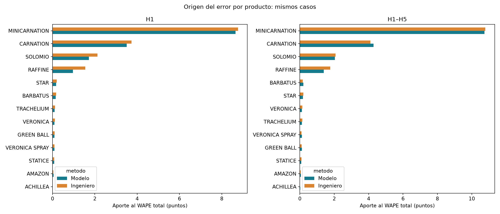

En H1, MINICARNATION representa 60,34 % del volumen y 55,23 % del error absoluto del modelo; CARNATION añade 22,36 %. Juntos concentran 77,59 % del error del modelo. MINICARNATION también domina el error del ingeniero (51,31 %). Su prioridad se explica sobre todo por escala: el WAPE del modelo en MINICARNATION es 14,33 %, inferior al 18,91 % de CARNATION. No significa que sea el producto de peor tasa.

La mayor parte de la ventaja en H1 procede de RAFFINE y SOLOMIO: reducen respectivamente 0,58 y 0,41 puntos del WAPE total, aproximadamente 69,11 % de la ventaja neta frente al ingeniero. MINICARNATION mejora poco en el agregado y el modelo gana allí sólo 3 de 8 meses. Sus tres semanas de mayor error concentran 16,85 % de su error: no se explica todo por un episodio aislado. En el extremo opuesto, ACHILLEA tiene WAPE 380,92 %, pero menos de 0,01 % del volumen y apenas 0,01 puntos del WAPE total. Requiere revisar sus casos, pero priorizar sólo ese porcentaje ocultaría los grupos de mayor impacto.

En horizontes largos aparece un problema distinto. CARNATION pasa de WAPE 18,91 % en H1 a 26,87 % en H5; el ingeniero obtiene 23,22 % en H5. Allí CARNATION aporta 0,67 puntos a la desventaja global del modelo. Esto orienta a revisar la anticipación y los cambios de producción en ese producto, sin dar por demostrada su causa.

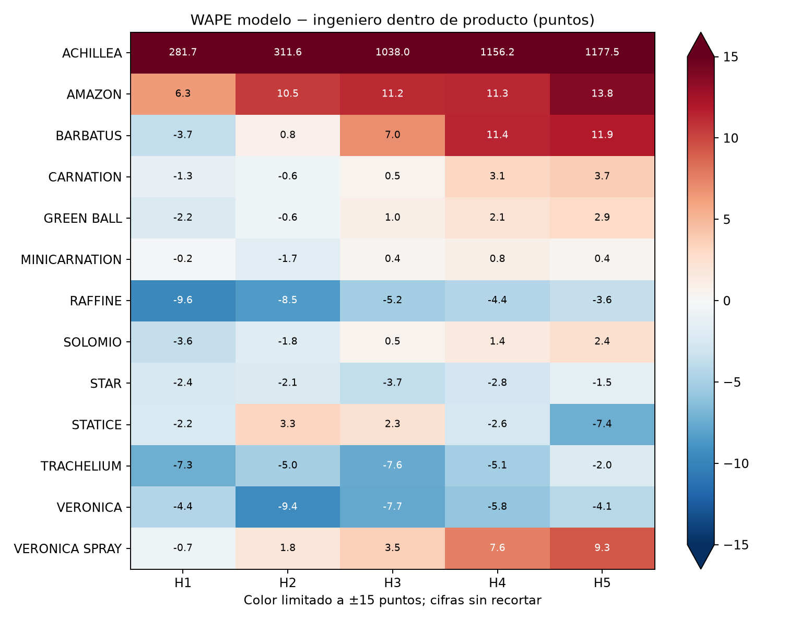

Dentro de MINICARNATION, ORANGE, HOT PINK y LIGHT PINK son los colores con mayor aporte al error H1 de ambos métodos. En el ingeniero, ORANGE tiene sesgo de -12,67 %, frente a -5,36 % del modelo. Sus variedades de mayor error son UCHUVA, LORENZO y NENUFAR. UCHUVA también es la variedad de mayor error del modelo (0,96 puntos del WAPE total). EPSILON aporta la mayor desventaja por variedad: WAPE 15,17 % frente a 10,11 % del ingeniero, diferencia que añade 0,17 puntos al WAPE total. Son criterios distintos: mayor error propio y mayor oportunidad frente al benchmark.

ACADEMY ilustra por qué el sesgo pequeño no basta: sesgo del modelo 0,19 %, pero WAPE 19,15 %, frente a 16,36 % del ingeniero. En H1 agregado, las sobreestimaciones del modelo aportan 7,21 puntos y las subestimaciones 8,45: se compensan en el sesgo de -1,23 %, pero se suman en el WAPE de 15,66 %. Corregir sólo el nivel promedio no resolvería esos errores de dinámica temporal.

Las subidas fuertes —real superior a 1,5 veces la media de cuatro semanas— presentan WAPE 28,12 % y sesgo -27,29 % en el modelo, frente a 26,78 % de WAPE del ingeniero. El modelo queda corto en esos episodios. Sin embargo, 89,39 % de su error H1 ocurre en casos dentro de 0,5–1,5 veces la media: no todo el problema son picos extremos. Esta clasificación usa el real conocido después y sólo sirve para diagnosticar.

La variabilidad previa moderada también identifica dificultad: en CARNATION, WAPE del modelo 26,32 % frente a 17,41 % con baja variabilidad; en MINICARNATION, 21,94 % frente a 13,81 %. Son asociaciones dentro de producto, no efectos causales; los casos de variabilidad alta tienen poco soporte. Tampoco se puede culpar automáticamente a la falta de curva: en MINICARNATION, los 66 casos con teoría completa tienen menor WAPE (11,78 %) que los 913 con respaldo (14,44 %), pero son poblaciones distintas. El Excel conserva esas comparaciones también para el ingeniero.

La revisión práctica debe concentrarse primero en MINICARNATION por volumen y en CARNATION H3–H5 por desventaja de anticipación; después en las semanas de UCHUVA, EPSILON y ACADEMY y sus referencias de producción previa. Las trayectorias muestran picos, alternancia de sobre/subestimaciones y huecos de comparación sin inventar ceros. Son hipótesis de seguimiento temporal y cobertura, no diagnósticos agronómicos ni evidencia de errores de registro. Antes de cambiar el modelo conviene contrastar esos episodios con información operativa; cualquier ajuste posterior necesita evaluación temporal nueva.

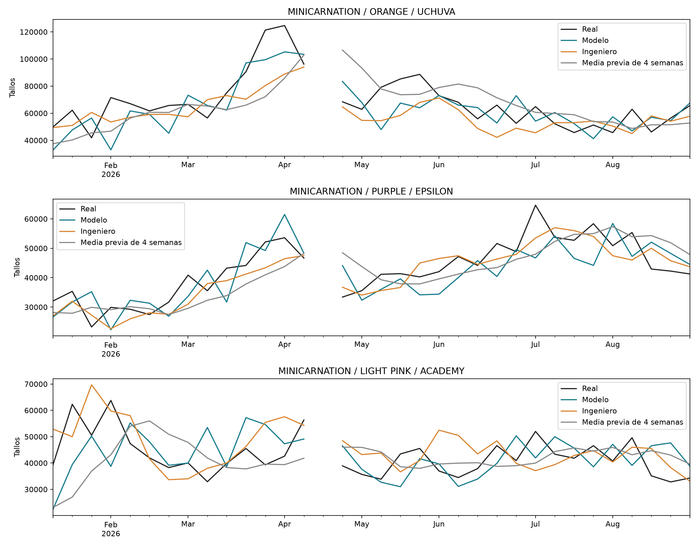

El notebook incluye además gráficos de colores y variedades, trayectorias de los productos, aportes de sobre/subestimación, estabilidad mensual, semanas críticas y tablas completas. La descomposición reproduce exactamente WAPE, sesgo y número de casos del benchmark.

## 6. Discusión: calidad, clima y distribución del error

El error no se distribuye uniformemente. MINICARNATION concentra el mayor volumen y la mayor parte del error, mientras CARNATION explica una desventaja relevante a horizontes largos. Los porcentajes extremos de productos pequeños no sustituyen esa lectura por impacto. El detalle por color y variedad aporta casos concretos para revisar: un sesgo casi nulo, como en ACADEMY, puede coexistir con errores semanales importantes. Por eso una corrección general del nivel no resuelve por sí sola el seguimiento de los cambios de producción. Estas explicaciones son descriptivas del periodo evaluado y requieren contrastar información operativa antes de atribuir causas.

La calidad de fuentes condiciona qué puede aprender y qué puede explicar el sistema. Un clima ausente en el periodo de interpretación puede producir importancia nula sin que eso describa el proceso agrícola. Actualizar la fuente, medir cobertura y comparar modelos temporales es necesario antes de concluir sobre su utilidad.

El EDA distingue cantidad y momento del corte, y no encuentra una regla general de desplazamiento climático con soporte estadístico claro. Los modelos evalúan relaciones no lineales e interacciones, pero una mejora de error tampoco certifica un mecanismo causal. Sólo se usa clima pasado: la meteorología futura hasta H5 sigue siendo desconocida para este experimento.

La procedencia de pilotos tampoco se resuelve suponiendo que números de bloque identifican finca. La coincidencia exacta aporta evidencia de GAITANA y deja desconocidos explícitos. Reducir el conjunto de pilotos puede perder cobertura y cambiar la ruta del pronóstico. Por eso se preservan ambos tipos de curva y sus comparaciones.

## 7. Conclusiones y continuidad

La cadena actual integra clima válido hasta septiembre, lluvia y ventanas recientes, una medida exploratoria de desplazamiento, curvas atribuibles a GAITANA y comparaciones temporales sobre los mismos casos. La elección anterior a 2026 es Boosting sin clima, con 19,46 % WAPE frente a 19,74 % del ingeniero en el panel principal. El reparto diario coherente obtiene 27,27 %, frente a 26,72 % del autónomo.

La siguiente comprobación útil es fijar esta configuración y registrar emisiones en un periodo nuevo. También se requiere confirmar las unidades de lluvia, disponibilidad real de reportes, identidad de los pilotos sin pareja y significado de días sin corte registrado. No ampliar a ARABELLA: el alcance de modelado y las conclusiones siguen restringidos a GAITANA.

El diagnóstico del origen del WAPE orienta esa continuidad: revisar MINICARNATION por volumen, CARNATION H3–H5 por anticipación y las semanas críticas de UCHUVA, EPSILON y ACADEMY. La prioridad se sostiene en aportes al error, persistencia y comparación emparejada, no sólo en el mayor WAPE local. No se cambiaron los modelos a partir de este EDA; cualquier mejora propuesta deberá evaluarse en datos posteriores.

Las siguientes mejoras se plantean como experimentos pendientes, no como resultados. Primero, comparar cinco ajustes independientes H1–H5 frente a la agrupación actual H1–H2/H3–H5, manteniendo casos y cortes para medir si compensa perder tamaño de entrenamiento. Segundo, estudiar especialización por producto y un experimento n−1: retirar un producto del entrenamiento y evaluar los productos restantes frente a un modelo entrenado con todos, sobre exactamente los mismos casos restantes. Esto distingue interferencia entre productos de una mejora aparente por quitar casos difíciles de la métrica. No demuestra capacidad para predecir el producto excluido, que sería otra pregunta.

(Pronóstico diario en revisión: siguientes pasos.) Mantener los resultados como avance, estudiar mejor calendario de reporte y ausencia de corte, y ajustar ventanas y parámetros mediante validación temporal anterior a una nueva evaluación. Comparar predicción autónoma y reparto coherente con el semanal sin confundir sus objetivos. Antes de ampliar modelos, revisar edades de curva sin soporte y semanas críticas de productos; no completar automáticamente con cero ni recalibrar usando el real de test.

### 7.1. Límites

Persisten la disponibilidad histórica supuesta de archivos, procedencia inferida de pilotos, representatividad agronómica y equivalencia entre tallos reportados y exportables. El EDA de desplazamiento analiza una ventana parcial y no mide retraso fisiológico de cohortes individuales. Los periodos fueron examinados durante desarrollo y no son test prospectivo intacto. El clima de estación no garantiza representar cada invernadero. No se han medido beneficios económicos ni adopción empresarial.

La literatura verificada, la validación empresarial y la pertinencia de PCA/MCA/PDN continúan pendientes; no se atribuyen resultados a componentes no ejecutados.

## Referencias de la evidencia y pendientes editoriales

Las referencias E1–E18 permiten ubicar la evidencia interna que sostiene las cifras y decisiones de este borrador. No sustituyen la bibliografía académica. La revisión de literatura del anteproyecto debe integrarse con lectura y citas verificadas de sus fuentes; aquí no se convierten nombres de artículos de la estructura original en afirmaciones bibliográficas no comprobadas.

| Referencia | Evidencia reproducible | Uso en el documento |
| --- | --- | --- |
| E1 | Proyecciones Teoricas Propias/Proyecciones_teoricas.ipynb | EDA de pilotos, camas, ciclos, inventario y curvas |
| E2 | Proyecciones Teoricas Propias/Proyecciones_teoricas_todos_los_anios.ipynb | Historia 2021–2026, cobertura y cinco planos |
| E3 | Analisis/10_base_analitica_proyecciones.ipynb | Conservación e integración semanal |
| E4 | Analisis/11_EDA_proyecciones.ipynb | Composición, cobertura, error y asociaciones |
| E5 | Analisis/12, 13 y 14 | Modelos, benchmark experto y tendencias diarias |
| E6 | Modelo_de_series_diario/01_base_diaria_EDA.ipynb | Calendario diario, conciliación y EDA |
| E7 | Modelo_de_series_diario/02_distribucion_semanal_a_diaria.ipynb | Distribución y evaluación diaria |
| E8 | Modelo_de_series_diario/03_SARIMA_SARIMAX_y_boosting.ipynb | Piloto temporal y convergencia |
| E9 | Proyecciones Teoricas Propias/00_catalogo_variedades y Auditoria_calidad_curvas.ipynb | Catálogo central y recuperación antes/después |
| E10 | Analisis/15_calidad_y_mejora_por_horizonte.ipynb | Diagnóstico del error, experimentos y pesos anteriores a 2026 |
| E11 | Modelo_de_series_diario/04_diario_con_memoria_semanal.ipynb | Efecto del nuevo total semanal, cobertura y sensibilidad diaria |
| E12 | Analisis/16_interpretacion_modelo_semanal.ipynb | Importancia por permutación y reproducción del ajuste |
| E13 | Analisis/17_inventario_modelos_train_test.ipynb | Inventario y errores de entrenamiento/evaluación por corte |
| E14 | Proyecciones Teoricas Propias/01_procedencia_pilotos_y_curvas_gaitana.ipynb | Procedencia inferida y sensibilidad de curvas |
| E15 | Analisis/18_EDA_clima_y_desfase.ipynb | Cobertura, lluvia, error de volumen y desplazamiento |
| E16 | Analisis/19_modelos_clima_y_curvas_gaitana.ipynb | Comparación temporal y elección previa a 2026 |
| E17 | Modelo_de_series_diario/05_diario_clima_actualizado.ipynb | Reparto del candidato y train/test compuesto |
| E18 | Analisis/20_EDA_origen_error_modelo_ingeniero.ipynb | Descomposición del WAPE y sesgo por producto, color, variedad y semanas |

Referencia técnica utilizada en la implementación: documentación oficial de SARIMAX de statsmodels, https://www.statsmodels.org/stable/generated/statsmodels.tsa.statespace.sarimax.SARIMAX.html.

### Correspondencia con la estructura anterior

La introducción conserva problema, objetivos y alcance. Los capítulos 2 y 3 desarrollan el entendimiento de fuentes y el EDA que antes figuraban como contenido previsto. El capítulo 4 concentra el método y el 5 sus resultados; el 6 integra la discusión que faltaba entre cifras y conclusiones. El capítulo 7 reúne conclusiones y límites. Se abandona la correspondencia rígida de todos los subtítulos entre metodología y resultados para dar continuidad a la explicación. Esta reorganización es una propuesta editorial para revisar con el asesor, no un cambio de resultados.

La literatura verificada, la revisión agronómica, la decisión sobre PCA/MCA/PDN y la validación empresarial siguen pendientes. Sus títulos no se mantienen como capítulos extensos vacíos. La documentación detallada de llaves, parámetros y tablas por segmento permanece en los notebooks y puede constituir anexos según las exigencias de entrega. Este documento es un borrador desarrollado del trabajo empírico, no una tesis lista para radicar.

### Inventario adicional de algoritmos y referencias

Se mantiene el diagnóstico de los ajustes de referencia de 17; no sustituye la selección climática de 19 ni sus tablas anteriores.

### Semanal agosto

| Modelo | WAPE train | WAPE test |
| --- | ---: | ---: |
| Ajuste_relativo_diario | 25,29 % | 16,12 % |
| Boosting_diario_MAE | 24,69 % | 14,95 % |
| Combinacion | 22,08 % | 15,02 % |
| Media4 | 32,21 % | 16,02 % |
| Memoria_larga | 22,00 % | 15,10 % |
| Revisiones | 22,08 % | 15,02 % |
| Separado | 22,16 % | 15,17 % |
| Sistema_anterior | 23,30 % | 15,82 % |
| Sistema_diario | 23,13 % | 15,39 % |
| Ultimo_valor | 28,86 % | 15,28 % |
| Ingeniero | No aplica | 14,89 % |

### Teoria completa mayo

| Modelo | WAPE train | WAPE test |
| --- | ---: | ---: |
| Ajuste_media4_sin_planos | 26,88 % | 16,21 % |
| Media4 | 34,34 % | 18,25 % |
| Modelo_teorico | 21,11 % | 23,75 % |
| Modelo_teorico_historia | 21,06 % | 23,14 % |
| Ridge_ajuste_teoria | 25,56 % | 19,80 % |
| Teoria_sin_ajuste | 42,44 % | 23,85 % |
| Teorico_sin_clima | 21,62 % | 22,77 % |
| Teorico_sin_memoria | 23,12 % | 30,42 % |
| Ultimo_valor | 30,98 % | 17,35 % |

### Diario agosto

(En revisión: desarrollo preliminar y siguientes pasos.)

| Modelo | WAPE train | WAPE test |
| --- | ---: | ---: |
| Boosting diario autónomo | 25,90 % | 26,65 % |
| Boosting reconciliado · memoria actualizada | 26,40 % | 27,02 % |
| Boosting_reconciliado | 27,34 % | 27,65 % |
| Perfil_8semanas | 28,20 % | 27,73 % |
| Perfil histórico · memoria actualizada | 27,24 % | 27,14 % |
| Uniforme · memoria actualizada | 28,52 % | 30,69 % |
| Uniforme_semanal | 29,27 % | 31,85 % |

### Piloto SARIMA agosto

(En revisión: desarrollo preliminar y siguientes pasos.)

| Modelo | WAPE train | WAPE test |
| --- | ---: | ---: |
| SARIMA | 19,48 % | 29,83 % |
| SARIMAX | 19,47 % | 29,54 % |

## Anexo. Diccionario de la base analítica común

Se agrupan las 47 columnas para facilitar la lectura. Es la base del notebook 10; las variables ampliadas se documentan en la metodología y no se confunden con este archivo. NaN, NaT y valores ausentes no significan cero.

| Columna(s) | Significado |
|---|---|
| finca, producto, color, variedad | Identifican la serie comercial: finca, producto, color y variedad cuya producción semanal se estudia. |
| origen | Lunes desde el que se emite el pronóstico; separa el pasado disponible del futuro por estimar. |
| horizonte | Horizonte del MODELO semanal: H1 es la semana del origen y H5 empieza cuatro semanas después. El modelo evalúa H1–H5, pero las proyecciones TEÓRICAS de cada plano abarcan 10 semanas y se cuentan desde la semana siguiente a fecha_plano. Son numeraciones distintas porque parten de fechas distintas. |
| semana_objetivo | Lunes de la semana que se pronostica; la semana abarca de lunes a domingo. |
| ultima_semana_utilizada | Lunes de la última semana de producción histórica utilizada, anterior al origen. |
| y | Producción real reportada de la semana objetivo, en tallos. Es la respuesta que se intenta predecir, no una variable que se pueda conocer anticipadamente. |
| produccion_lag1, produccion_lag2, produccion_lag3 | Producción real, en tallos, de una, dos y tres semanas calendario antes del origen, respectivamente. |
| media_4, media_8 | Promedio semanal de tallos durante las cuatro u ocho semanas anteriores al origen; requiere las cuatro u ocho observaciones. |
| desv_4 | Desviación estándar de las cuatro semanas previas, en tallos: resume cuánto varió la producción reciente. |
| tendencia_4_8 | media_4 menos media_8, en tallos. Un valor negativo indica un nivel reciente inferior al promedio de ocho semanas. |
| cambio_reciente | produccion_lag1 menos produccion_lag2, en tallos: cambio entre las dos últimas semanas. |
| observaciones_previas | Número de semanas históricas con producción reportada antes del origen; no tienen que ser consecutivas. |
| temperatura_semana_lag1, humedad_semana_lag1, radiacion_semana_lag1 | Promedio climático de la semana anterior al origen, construido con los promedios diarios válidos. Una semana requiere al menos cinco días válidos. Conservan las unidades de la fuente depurada. |
| temperatura_semana_media4, humedad_semana_media4, radiacion_semana_media4 | Promedio de los cuatro valores semanales anteriores de cada variable climática; requiere las cuatro semanas. El clima corresponde a la finca, no a una medición por variedad. |
| fecha_estacional | Fecha de la semana objetivo menos 52 semanas (364 días). |
| produccion_52 | Producción real de la misma serie comercial en fecha_estacional, en tallos; referencia estacional del año anterior. |
| semana_seno, semana_coseno | Dos números que ubican la semana objetivo en un calendario circular: seno indica posición horizontal y coseno posición vertical (imaginando una aguja que parte de arriba y gira como un reloj). Se calculan a partir del número de semana del año; no son tallos ni porcentajes de producción. Para la semana 36 del ejemplo de DINO valen −0,935 y −0,355. Debajo de esta tabla se muestra el cálculo completo, paso a paso. |
| union_finca, union_producto, union_color, union_variedad | Nombres normalizados para unir la producción con las proyecciones. No son identificadores oficiales ni cultivos adicionales. |
| plano | Archivo o versión del plano del que procede la proyección seleccionada para ese origen. |
| fecha_plano | Fecha nominal de esa versión del plano. |
| disponible | Fecha supuesta de disponibilidad usada por el proceso para permitir utilizar ese plano. No certifica su publicación histórica real. |
| teoria | Producción teórica, en tallos, para la semana_objetivo de esta fila y la misma finca, producto, color y variedad, tomada del plano seleccionado. Se une por la fecha objetivo, no por igualdad del número de horizonte. No acumula H1–H5. En DINO, la semana del 31 de agosto al 6 de septiembre de 2026 es H5 del modelo emitido el 3 de agosto, pero horizonte teórico 7 del plano del 13 de julio: teoria = 27.916,61 tallos. Puede ser parcial si faltan grupos por cubrir; no es el pronóstico final del modelo. |
| cohortes | Número de grupos de plantas con la misma finca, producto, color, variedad, clave de curva y fecha de siembra dentro del plano. Un grupo puede reunir varias camas; no equivale a una cama física ni cuenta tallos. |
| sin_cobertura | Cantidad de cohortes sin cobertura válida de proyección; los estados proyectada y siembra_posterior no cuentan como faltantes. |
| curva_completa | Verdadero cuando existe teoría y sin_cobertura es cero; indica cobertura completa de esa proyección. |
| teoria_modelo | Valor de teoria habilitado como base teórica: se conserva si curva_completa es verdadero y queda vacío si la proyección es parcial. No es la predicción final del modelo. En DINO está vacío porque hay dos grupos sin cobertura. |
| teoria_previa_1, teoria_previa_2 | Teorías de una y dos versiones anteriores del plano para la MISMA semana_objetivo y serie comercial. El 1 y el 2 cuentan versiones hacia atrás, no H1 y H2. Pueden existir incluso en H5 del modelo porque cada plano tiene 10 semanas teóricas. En DINO corresponden a los horizontes teóricos 8 y 9 de los planos anteriores. Aunque existían sus sumas parciales, ambas columnas están vacías porque solo conservan teorías anteriores con cobertura completa. También pueden faltar si no existe una versión previa que alcance esa semana objetivo; no se busca otra versión más antigua para reemplazar una incompleta. |
| revision_teoria | Cambio en tallos entre la teoría completa del plano seleccionado y teoria_previa_1, siempre para la misma semana objetivo. Positivo: la nueva versión proyecta más; negativo: menos. Si alguna de las dos proyecciones no es utilizable, queda vacío. No compara H5 contra H1. |
| antiguedad_curva | Tiempo en semanas entre origen y fecha_plano: indica qué tan antiguo es el plano seleccionado al emitir el pronóstico. No es la edad de las plantas. En DINO: del 13 de julio al 3 de agosto = 3 semanas. |
| desviacion_reciente_teoria | media_4 menos teoria_modelo, en tallos. Compara el promedio real de las cuatro semanas anteriores al origen con la teoría de la semana objetivo. No es un error de pronóstico porque compara períodos distintos. En DINO está vacío porque teoria_modelo está vacío. |
| admisible_modelo | Indica si la fila tiene media_4 y al menos 26 semanas históricas con producción reportada. No exige teoría completa ni y conocido, y no indica train o test. En DINO es verdadero por su historial, aunque la teoría no esté habilitada. |
| motivo_cobertura | Explica la cobertura teórica: curva_completa = proyección cubierta; cohortes_sin_curva = quedan grupos sin cobertura válida; sin_snapshot_disponible = no hay plano elegible; sin_pareja_comercial_u_objetivo = no coincide la serie o la semana objetivo. En DINO, cohortes_sin_curva corresponde a edades 9 y 16 sin valor en la curva utilizada; la etiqueta no demuestra que falte toda la curva de la variedad. |

Semana seno y coseno son dos coordenadas del calendario anual: seno(2π × semana ISO / 52) y coseno(2π × semana ISO / 52). Mantienen cerca las semanas 52 y 1; en la semana 36 valen aproximadamente −0,935 y −0,355. No son porcentajes de producción ni indican una caída. El ciclo fijo de 52 semanas aproxima los años con semana ISO 53.
