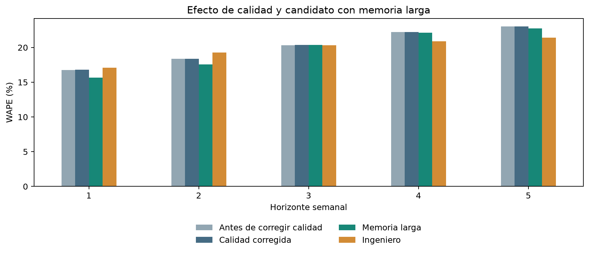
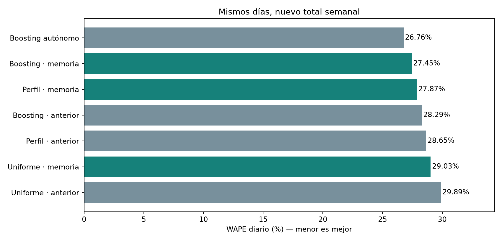
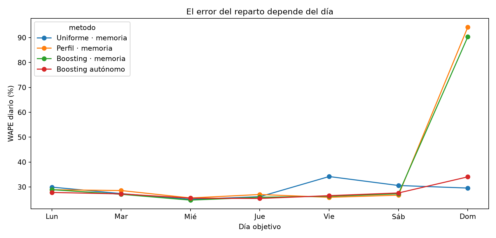
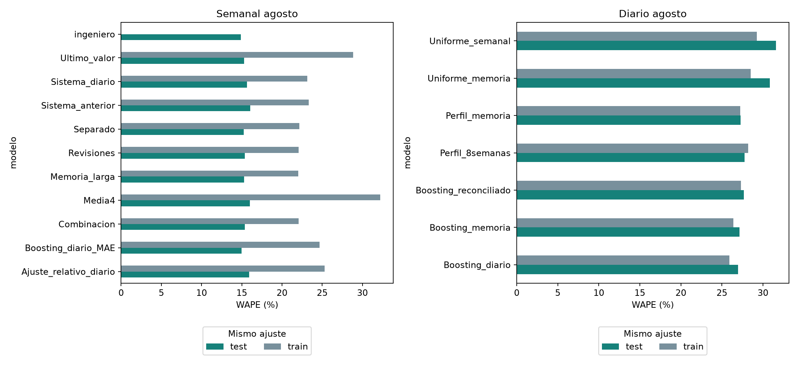

# Del comportamiento productivo al pronóstico semanal y diario en La Gaitana Farms

**Borrador integrado para revisión académica — octubre de 2026**

Elián Durán · Julián Osorio · Anderson Gonzalez

Universidad de los Andes · Facultad de Ingeniería Industrial · Maestría en Inteligencia Analítica para la Toma de Decisiones

## Resumen

El proyecto estudia cómo anticipar la producción registrada de La Gaitana Farms por producto, color y variedad, utilizando planos y curvas de rendimiento como punto de partida y producción reciente y clima como información de ajuste. El entendimiento de las fuentes precede al modelado: los planos son fotografías de existencias, los pilotos permiten estimar rendimientos por edad y los movimientos de corte constituyen la referencia observada.

Se reconstruyeron proyecciones para 292 versiones semanales seleccionadas entre 2021 y 2026. Una auditoría recuperó información excluida por copias equivalentes de pilotos y por exigir un ID SQL único aun cuando la identidad comercial fuera inequívoca. Se centralizó el catálogo de variedades conservando códigos originales y ambigüedades reales. La cobertura de teoría completa pasó de 17,96 % a 21,25 % de los casos con producción observada. Esta cobertura describe casos, no porcentaje de volumen ni de plantas.

Tras separar el efecto de calidad del cambio de modelos, el candidato separación + memoria larga obtuvo 19,59 % WAPE en los mismos 15.838 casos principales de 2026; el ingeniero obtuvo 19,74 %. El candidato presenta menor error agregado en ese periodo. En diario, cambiar el total por memoria larga reduce el WAPE reconciliado de 28,29 % a 27,45 %, frente a 26,76 % del autónomo. La evaluación distingue precisión libre, conservación del total y sensibilidad a días sin reporte. Se documentan además importancia por permutación y errores de entrenamiento/evaluación de cada ajuste. Los resultados son retrospectivos; equivalencia exportable, publicación histórica y utilidad operativa continúan pendientes de validación.

Palabras clave: producción florícola, curvas de rendimiento, calidad de datos, pronóstico semanal, distribución diaria, validación temporal.

## 1. Introducción: qué se necesita anticipar y por qué

La pregunta que organiza este trabajo es cuánto corte puede esperarse de cada combinación de producto, color y variedad, con qué anticipación y cómo podría distribuirse durante la semana. La combinación comercial importa porque dos estimaciones con el mismo total de tallos pueden describir disponibilidades muy diferentes. Un exceso en una variedad no compensa automáticamente una falta en otra. Por ello, evaluar únicamente el total de la finca sería insuficiente para el propósito de planeación planteado en el proyecto.

El punto de partida combina tres perspectivas. El plano informa las plantas y composiciones registradas en una fecha; las estadísticas de camas piloto describen rendimientos observados a distintas edades; y el estimado del ingeniero aporta una referencia experta con la cual contrastar el sistema. La producción real permite comprobar lo ocurrido. El clima y el comportamiento reciente del corte se incorporan para estudiar si ayudan a explicar las diferencias entre lo proyectado y lo registrado.

La contribución buscada es construir una secuencia comprensible desde esas fuentes hasta una predicción evaluable. Primero se examina si los registros se pueden unir sin mezclar ciclos ni duplicar cantidades. Después se reconstruyen curvas y proyecciones con cobertura explícita. Finalmente se evalúa si las señales recientes permiten corregirlas y si el pronóstico semanal ayuda a anticipar la distribución diaria. Cada paso responde a una dificultad encontrada en los datos.

### 1.1. Objetivo y preguntas de trabajo

El objetivo general es desarrollar y evaluar un sistema reproducible de pronóstico de producción por producto, color y variedad para GAITANA, que integre proyecciones propias, producción reciente y clima, y permita comparar su desempeño con el estimado del ingeniero.

Las preguntas específicas son: ¿qué parte de la producción puede representarse con las curvas disponibles?, ¿qué revelan las diferencias entre versiones de planos?, ¿qué información reciente ayuda a corregir la teoría?, ¿en qué horizontes funciona mejor el ajuste? y ¿cuánto aporta un modelo diario frente a repartir uniformemente el pronóstico semanal? Estas preguntas conectan la caracterización de datos con resultados verificables.

### 1.2. Alcance de la evidencia

El análisis principal se limita a la finca GAITANA; GAITANA PPTO se conserva como una categoría distinta. La variable efectivamente observada son tallos reportados. Aunque la motivación del proyecto y el estimado del ingeniero se refieren a producción exportable, su equivalencia con esa variable debe ser confirmada antes de presentar los resultados como un pronóstico certificado de tallos exportables.

Se estudian cinco horizontes semanales y los siete días de la primera semana pronosticada. Los periodos ya examinados corresponden a desarrollo retrospectivo. La información se ordena temporalmente para evitar usar producción o clima futuro observado, pero la fecha histórica de publicación o corrección de algunas fuentes no está acreditada. Por tanto, el ejercicio aproxima una situación de pronóstico bajo supuestos de disponibilidad que se hacen explícitos.

## 2. Entender las fuentes antes de construir el pronóstico

### 2.1. Tres cantidades que no deben confundirse

El inventario de plantas, el rendimiento de una cama piloto y los tallos cortados son cantidades distintas. El plano es una fotografía de existencias: si una cama con mil plantas aparece en dos planos consecutivos, no se han observado dos mil plantas nuevas. Las estadísticas piloto permiten relacionar un corte con las plantas de una cama y su edad. La producción real, por su parte, reúne movimientos de corte y se agrega para evaluar los pronósticos. Esta distinción determina los denominadores, las llaves de integración y las reglas para interpretar cambios. [E1–E3]

| Fuente | Qué representa | Papel en el trabajo | Precaución principal |
| --- | --- | --- | --- |
| Planos de siembra | Existencias y composición reportadas en una fecha | Ubicar plantas y edades para proyectar | No sumar fotografías como nuevas siembras |
| Estadísticas y camas piloto | Corte y plantas de observaciones identificadas por cama y ciclo | Estimar rendimiento por variedad y edad | No confundir pilotos con producción total |
| Producción real | Movimientos de tallos registrados | Historia reciente y variable de evaluación | Ausencia de registro no equivale a cero |
| Clima | Mediciones ambientales con frecuencia mayor que la producción | Señales históricas agregadas | Confirmar unidades y disponibilidad |
| Estimados del ingeniero | Pronóstico comercial por entrega | Referencia independiente | Comparar mismas llaves y entregas oportunas |

### 2.2. La edad y el ciclo dan sentido a una curva

Para relacionar un corte piloto con las plantas que lo originaron no basta con que coincida el nombre de la variedad. Una referencia de cama puede aparecer en distintos ciclos. La integración utiliza el archivo, la variedad homologada y la referencia completa de la cama; añade la fecha de siembra cuando existe y, en su defecto, año y semana. Una coincidencia ambigua permanece pendiente. Forzarla podría alterar el rendimiento aun cuando el total de filas pareciera razonable. [E1]

La edad se expresa en semanas completas entre la semana de siembra y la de corte. La curva describe el rendimiento observado para una variedad a cada edad disponible. Es una representación empírica construida con los pilotos utilizables, no una ley biológica validada para todas las camas. Diferencias de época, condiciones de cultivo y representatividad de los pilotos pueden afectar su traslado al inventario de plantas; aquí se reconocen como explicaciones por investigar, sin atribuirles efectos causales no medidos.

### 2.3. Qué cambia cuando cambia un plano

Una ubicación física se identifica mediante finca, invernadero y número de cama. Esa ubicación puede persistir mientras cambia su variedad o su fecha de siembra. Por eso el análisis original separa camas persistentes, apariciones, desapariciones y cambios de composición, e incluye la comparación directa de las semanas 32 y 33. Una aparición en el archivo se interpreta como un cambio reportado; por sí sola no prueba que se haya realizado una nueva siembra. [E1]

Esta lectura evita atribuir toda revisión del pronóstico a la curva. Entre dos planos pueden cambiar las plantas, las edades, la composición, la historia utilizada para estimar rendimientos o la cobertura. El estudio de versiones permite observar el resultado conjunto de esos cambios, aunque no constituye todavía una descomposición causal de sus aportes.

## 3. Análisis exploratorio: qué enseñan los datos sobre el problema

### 3.1. Calidad e historia utilizable de los pilotos

La ejecución guardada del notebook original, correspondiente a los libros de la edición 2026, conserva 530.250 registros de estadísticas identificados o con corte. De ellos, 423.373 tienen unión única con los pilotos: 79,84 %. Los 106.877 restantes no pueden tratarse como un faltante menor. Sin embargo, la cobertura de unión de los cortes fechados en 2026 supera el 96 % en los cuatro grupos de libros. La diferencia entre el agregado histórico y el periodo reciente indica que los problemas deben localizarse por edición, producto y fecha, en lugar de descartar una fuente completa. Estas cifras describen esa edición, no la suma de todas las ediciones anuales. [E1, sección 4.4]

La vista utilizable para rendimientos contiene 370.172 observaciones, incluidas 74.265 con corte cero. El cero registrado aporta información sobre una cama observada y se conserva. Una semana que no aparece en la fuente no aporta la misma evidencia. Además de la unión, la vista exige plantas positivas, edad válida, corte no negativo e identificación consistente, y controla repeticiones de cama, ciclo y semana. Conservar la base original y separar la vista analítica permite distinguir falta de historia de exclusiones por calidad.

Los libros anuales pueden contener historia repetida. Por eso cada plano se asocia con la edición de su año, filtrando cortes anteriores a su fecha. Concatenar todas las ediciones para estimar una curva podría repetir observaciones y darles más peso. El filtro temporal evita usar cortes futuros, aunque no reconstruye cuándo se corrigió cada dato dentro del libro. [E2]

### 3.1.1. La auditoría recuperó información existente

Las cifras anteriores describen la ejecución original. La revisión posterior encontró dos pérdidas evitables. Primero, algunas referencias piloto tenían varias filas idénticas en todos los atributos utilizados, salvo fila e identificador técnico. Consultarlas como candidatas diferentes generaba ambigüedad sin aportar valores alternativos. Se consulta una sola referencia equivalente, sin borrar registros fuente ni sumar o eliminar movimientos de corte. Una comprobación en el Excel de clavel verificó, por ejemplo, igualdad completa entre las filas 97 y 176 del piloto BACIO-30-204. [E9]

Segundo, el maestro contiene 2.915 combinaciones comerciales y 53 de ellas tienen múltiples IDs. Para curvas se usa una clave explícita de producto, color y variedad cuando la combinación es única; no se inventa un ID ni se selecciona arbitrariamente uno de los códigos. Lorenzo y Brut muestran por qué exigir un único código podía ocultar historia existente. Los colores distintos y las combinaciones realmente ambiguas permanecen separados.

El catálogo común se ubica en `01_maestros_y_geografia/Catalogo_analitico` y se regenera mediante el notebook 00. Incluye 33 combinaciones con distintos códigos de obtentor, señaladas para revisión. La equivalencia comercial no certifica identidad genética ni resuelve diferencias agronómicas entre códigos. Los códigos de obtentor no se convierten en nombres sin una referencia verificada.

| Edición | Observaciones utilizables antes | Después | Recuperadas en ventanas de planos |
| --- | --- | --- | --- |
| 2021 | 176.110 | 205.321 | 12.782 |
| 2022 | 220.422 | 257.545 | 15.661 |
| 2023 | 267.837 | 316.185 | 21.113 |
| 2024 | 319.713 | 379.560 | 25.226 |
| 2025 | 340.391 | 410.583 | 21.737 |
| 2026 | 370.172 | 444.476 | 13.963 |

Las recuperaciones de ediciones diferentes no se suman como historia única porque los libros repiten periodos. Tampoco toda fila recuperada modifica una curva: la última columna cuenta sólo las observaciones que entran en alguna ventana de 78 semanas de los planos de esa edición. Se verificó que las observaciones previamente utilizables conservaran corte, plantas, fechas y edad, y que no se multiplicaran movimientos. Las proyecciones se reconstruyeron antes de reentrenar los modelos.

### 3.2. Cómo se obtiene y cómo se lee una curva

En cada fecha de plano se utilizan las 78 semanas anteriores de historia. Cada observación aporta el cociente entre corte y plantas. Dentro de cada grupo variedad–edad se calcula el promedio de esos rendimientos, después de limitar los extremos con el criterio de 1,5 rangos intercuartílicos cuando existen al menos cuatro observaciones. El dato original permanece disponible para auditoría; con menos observaciones no se aplica ese ajuste. No se extrapolan edades sin datos. [E1–E2]

La elección del promedio es relevante: la curva utilizada promedia rendimientos de observaciones, mientras que algunos resúmenes del EDA calculan suma de cortes dividida por suma de plantas observadas. Este último es un promedio ponderado por plantas y su denominador acumula exposiciones planta–semana; no cuenta plantas únicas. Ambos resúmenes describen aspectos relacionados, pero no son intercambiables.

Para leer una curva se deben mirar conjuntamente el rendimiento y su soporte. Una edad sostenida por muchas observaciones tiene una base empírica diferente de otra con una sola observación. Se conserva el ejemplo de Solomio–Ard elegido en la revisión inicial, ahora recalculado con las correcciones, para observar su soporte sin escogerlo por un buen error de predicción. Los huecos se mantienen y el número de observaciones se presenta en un panel separado. La figura ilustra la lectura del procedimiento; no representa por sí sola todas las variedades. La agrupación utiliza la identidad comercial y la edad; los IDs del maestro se conservan como trazabilidad.

En el ejemplo de Solomio–Ard, el soporte se concentra en las edades más tempranas del tramo observado y disminuye considerablemente después. Aparecen además puntos aislados por encima de doscientas semanas, respaldados por una sola observación por edad. Su presencia exige revisar fechas y ciclos con el equipo agronómico antes de interpretar esos rendimientos como un comportamiento representativo. No se eliminan ni se unen visualmente a través de las edades ausentes. La curva hace visible así una necesidad concreta de revisión de calidad que quedaría oculta si se mostrara únicamente la proyección agregada.

La producción teórica de una semana se obtiene multiplicando las plantas de cada cohorte por el rendimiento correspondiente a su variedad y edad proyectada, y sumando los aportes cubiertos. Si una cohorte no tiene rendimiento disponible, su aporte es desconocido. La suma calculada en ese caso es parcial, aunque pueda verse como un número perfectamente válido en una tabla. Esa distinción es central para interpretar las proyecciones y para decidir cuándo el modelo puede corregirlas.

### 3.3. Cobertura: tener una curva no equivale a poder proyectar todo

El inventario general contiene 294 archivos de planos; 293 son procesables y 292 quedan seleccionados al escoger una versión por año y semana. El plano 2022-S02 carece de la hoja Datos. La construcción produce diez semanas proyectadas por plano, con cobertura y cantidades parciales explícitas. Ese horizonte de construcción se distingue de H1–H5 del modelo, definido a partir de su fecha de emisión. [E2–E3]

Se distinguen dos problemas de cobertura. Una variedad puede no tener ninguna observación utilizable en la ventana de 78 semanas, por ausencia de historia, problemas de nombres o exclusiones de calidad. Otra puede tener curva, pero carecer del rendimiento para la edad exacta requerida. Las listas explícitas de ambos notebooks separan estos casos. Una variedad incluida en la lista de faltantes de algún plano no necesariamente carece de curva durante todo el periodo.

La cobertura también cambia al pasar de plantas a casos de pronóstico. En el EDA de la base semanal, 44.848 de 211.001 casos con producción observada tienen teoría completa: 21,25 %, frente a 17,96 % antes de la corrección. Este porcentaje cuenta combinaciones de serie, origen y horizonte; no representa porcentaje del volumen producido ni porcentaje de plantas cubiertas. Exigir que todas las cohortes de una combinación tengan curva es más estricto que informar cuánto inventario sí pudo proyectarse. [E4]

Esta evidencia modifica el diseño del sistema. Un ajuste que funcionara únicamente con teoría completa dejaría fuera gran parte de los casos observados. Se mantiene una ruta de corrección de teoría y se incorpora un respaldo basado en producción reciente. La calidad del sistema se evalúa junto con su cobertura, y las sumas parciales no se transforman artificialmente en ceros ni en pronósticos completos.

### 3.4. Qué muestran los cinco últimos planos

Los cinco últimos planos seleccionados corresponden a las semanas 29 a 33 de 2026; en la semana 32 se utiliza la edición actualizada. Para compararlos se alinean las mismas semanas objetivo. Comparar únicamente el primer punto de cada proyección mezclaría fechas de producción diferentes y no mediría una revisión del mismo objetivo. [E2]

Para la semana objetivo que comienza el 17/08/2026, el total parcial pasa aproximadamente de 1.845.055 tallos en el plano 29 a 1.792.408 en el plano 33. Entre los planos 32 y 33 cambia -22.980 tallos (-1,27 %). La revisión muestra que el insumo teórico cambia conforme llega otra fotografía de inventario e historia; no demuestra que la versión más reciente sea más exacta. Para hablar de precisión se necesita emparejar cada versión con producción real comparable y controlar su cobertura.

Esto justifica conservar versiones anteriores como posibles señales del modelo. Permite preguntar si las revisiones contienen información sobre el error futuro, en lugar de asumir que toda actualización constituye una mejora. También obliga a conservar la fecha de emisión: la misma cantidad teórica tiene un significado distinto si se obtuvo una o varias semanas antes del objetivo.

### 3.5. Escala, composición y evolución de la producción real

La base de GAITANA conserva 327.991.200 tallos en 44.053 combinaciones observadas de serie y semana. Miniclavel reúne el 62,87 % del volumen y clavel el 18,47 %; juntos representan 81,34 %. Solomio aporta 8,08 % y Raffine 5,61 %. Por tanto, una métrica agregada sensible al volumen refleja en gran medida el comportamiento de miniclavel. La evaluación debe acompañarse de cortes por producto, color y variedad para reconocer dónde se concentra una mejora o una dificultad. [E3–E4]

Los totales agrupados por año del lunes semanal pasan de 48,70 millones en 2022 a 61,27 millones en 2025. El periodo de 2026 contiene 35 semanas reportadas y 47,62 millones de tallos, por lo que no debe compararse como si fuera otro año completo. Las diferencias anuales pueden combinar cambios de composición, cobertura y nivel productivo. La trayectoria observada describe la fuente; no permite atribuir por sí sola crecimiento a una práctica agrícola específica.

La variación entre series también es amplia: la mediana de producción semanal observada es 3.130 tallos, mientras que el percentil 90 supera 21.076. Esta heterogeneidad explica por qué se estudian modelos compartidos con identificación comercial y por qué el error debe leerse tanto en tallos como en proporción al volumen. El análisis disponible no identifica causalmente picos por festividades o eventos comerciales; incorporarlos exigiría un calendario validado y un contraste específico.

### 3.6. Dónde se separan la teoría y la producción registrada

Sobre casos con teoría completa, el EDA define error como producción real menos teoría. Un valor negativo significa sobreestimación teórica. En H1, el error medio actualizado es -2.666 tallos y el WAPE descriptivo es 42,96 %. El signo se interpreta con la definición real menos teoría; un error negativo corresponde a sobreestimación. La curva aporta una referencia interpretable, pero trasladarla directamente al inventario no reproduce con suficiente precisión todos los cortes observados. [E4]

Este diagnóstico no se compara directamente con el WAPE del ingeniero de 2026: cambia tanto el periodo como la población evaluada. Tampoco la leve reducción del WAPE agregado entre H1 y H5 prueba que anticipar más semanas sea más fácil, porque los horizontes no contienen exactamente las mismas series. La comparación justa exige mantener las mismas observaciones dentro de cada experimento.

El resultado orienta el problema de modelado hacia el ajuste de la diferencia entre real y teoría. A la vez, la falta de cobertura exige una referencia alternativa para los demás casos. Ambas decisiones proceden del EDA: hay un error que corregir donde existe teoría completa y un problema de información donde no existe.

### 3.7. Producción reciente, clima e historia de las proyecciones

Para evitar que las series grandes dominen una correlación conjunta, el EDA calcula asociaciones de Spearman dentro de cada serie y horizonte, exige al menos veinte pares y resume sus resultados. Esta exploración utiliza objetivos cerrados antes del 7 de julio de 2025. Con las proyecciones corregidas, en H1 la mediana de asociación entre producción de la semana anterior y error real menos teoría es 0,28; para el cambio reciente es 0,20. En H5 son -0,03 y 0,06, respectivamente. Son asociaciones descriptivas, no efectos causales. [E4]

El clima se examina dentro de las series, con rezagos conocidos al origen y cobertura explícita. Una asociación agregada pequeña no demuestra ausencia de importancia productiva: puede ocultar diferencias entre variedades o respuestas no lineales. Su utilidad predictiva debe contrastarse sobre las mismas observaciones, sin introducir clima futuro realizado.

La revisión de teoría en H1 tiene una mediana de asociación de -0,05 y la teoría anterior de -0,35. La segunda requiere cautela porque el error incluye la teoría actual, relacionada con las versiones anteriores. Por eso el proyecto prueba explícitamente el bloque de revisiones en lugar de dar por demostrado su aporte.

### 3.8. El calendario diario plantea una pregunta adicional

Al desagregar la producción aparecen 227.623 días-serie observados dentro de un calendario de 1.374.399 filas para 663 series. La suma de los cortes diarios coincide exactamente con el panel semanal por cada llave. Las filas restantes mantienen un valor faltante: construir un calendario no prueba que todas las series estuvieran activas durante todo el intervalo. [E6]

En el agregado de la finca, los sábados reúnen 65,54 millones de tallos reportados y los domingos 3,65 millones. Además, hay reporte dominical en sólo treinta fechas del periodo, frente a varios centenares para los demás días. El patrón muestra que un reparto uniforme de una séptima parte por día desconoce la distribución registrada. No permite concluir que la producción física del domingo sea siempre nula: calendario de corte y calendario de registro pueden diferir y requieren validación operativa.

El total semanal también puede ocultar cambios recientes. Dos series con un total parecido en la semana anterior pueden llegar al lunes con trayectorias distintas en los últimos tres o cinco días. De ahí surge la extensión con medias, sumas, tendencia y antigüedad del último corte. Las ventanas siguen días de calendario y se acompañan de conteos observados; no toman simplemente las últimas filas disponibles ignorando huecos.

### 3.9. Del hallazgo a la decisión metodológica

| Hallazgo del EDA | Decisión que orienta | Qué debe comprobar el modelo |
| --- | --- | --- |
| Los planos son fotografías y cambian entre versiones | Conservar origen, objetivo y versión | Si la historia de revisiones aporta fuera del ajuste inicial |
| Hay variedades sin curva y edades sin soporte | Marcar cobertura y usar respaldo explícito | Precisión y cobertura del sistema completo |
| La teoría presenta diferencias sistemáticas con lo registrado | Aprender una corrección | Mejora frente a referencias sobre casos comunes |
| El volumen se concentra y las series tienen escalas diferentes | Desglosar métricas por segmento | Que el agregado no oculte deterioros relevantes |
| La memoria reciente se asocia más con el error cercano | Añadir rezagos y tendencias de corte | Aporte por horizonte, sin asumir causalidad |
| El registro diario no sigue una distribución uniforme | Comparar perfiles y modelos diarios | Error diario y coherencia con la semana por separado |

## 4. Diseño del sistema de pronóstico

### 4.1. Integración, calendario y disponibilidad

La unidad semanal es finca, producto, color, variedad y semana. La base de pronóstico agrega origen y horizonte: una semana objetivo puede aparecer varias veces porque fue anticipada en fechas distintas. Por eso sus cantidades no se suman como inventario producido. Las proyecciones ya calculadas se incorporan como insumo; los modelos de ajuste no vuelven a consultar plantas ni curvas para reconstruirlas. [E3]

H1 corresponde a la semana que comienza el lunes de emisión y H5 a la que comienza cuatro semanas después. Sólo se usan semanas cerradas al entrenar. Las variables diarias se desplazan un día y las predicciones de los siete días de H1 se congelan al lunes, sin actualizarse con lo ocurrido dentro de esa semana. Se supone que los reportes pasados ya están disponibles; su latencia real debe confirmarse. AL1 aporta una referencia de disponibilidad supuesta para los planos, no una prueba de publicación.

Las homologaciones conservan la identidad comercial y no fuerzan coincidencias ambiguas. Los movimientos legítimos de producción se mantienen, los objetivos ausentes no se imputan y los parámetros de imputación de predictores se estiman con entrenamiento. Una prueba que modifica producción futura verifica que las variables anteriores al origen permanezcan iguales. Estos controles hacen revisable el significado de cada caso.

### 4.2. Modelo semanal y señales recientes

Cuando hay teoría completa, el sistema aprende la diferencia entre producción real y teoría. En los otros casos utiliza una corrección de la media de producción reciente de cuatro semanas. Los modelos de boosting comparten información entre series e incorporan identificación comercial, horizonte, memoria semanal y los bloques de clima y teoría definidos en los notebooks. Las comparaciones de bloques permiten estudiar su aporte sin confundir una muestra diferente con una mejora. [E5]

La extensión incorpora 28 variables diarias: medias, sumas y conteos de corte en ventanas de 3, 5, 7 y 14 días; dispersión, rezagos, media exponencial, tendencias y días desde el último corte; y medias pasadas de temperatura, humedad y radiación. También se evalúa una corrección relativa. Una variante de pérdida absoluta se ensayó después de inspeccionar resultados y se identifica como exploratoria; además cambia la forma de combinar las rutas, por lo que su resultado no aísla únicamente el efecto de la función de pérdida.

Los candidatos semanales usan parámetros fijos de boosting: tasa de aprendizaje 0,08, 80 iteraciones, hasta 15 hojas, mínimo 40 observaciones por hoja, regularización L2 de 1 y semilla 42. El detalle reproducible permanece en los notebooks. El reentrenamiento mensual permite comparar los candidatos sobre los mismos orígenes de 2026, sin ajustar cada combinación hasta obtener un resultado favorable.

### 4.2.1. Experimentos acotados después de corregir calidad

El experimento 15 separa el efecto de las dos correcciones de datos del cambio de arquitectura. Compara la misma arquitectura diaria antes y después de calidad; luego separa modelos para H1–H2 y H3–H5, añade memoria de doce semanas, dispersión y conteos, y finalmente añade historia de proyecciones a las rutas teórica y de respaldo. Las medias de cuatro/ocho semanas y la referencia de un año ya existían y no se presentan como variables nuevas. Cada etapa conserva la anterior y añade un bloque. [E10]

La combinación sencilla usa pesos de 0, 0,25, 0,50, 0,75 o 1 sobre el modelo y una referencia de media4 o teoría con respaldo. Los pesos por grupo de horizontes se eligen mediante predicciones de noviembre–diciembre de 2025, con entrenamiento anterior a cada origen y objetivos cerrados antes de enero de 2026. Se mantienen fijos al evaluar 2026. El periodo 2026 continúa siendo desarrollo retrospectivo y no selecciona esos pesos.

### 4.3. Comparación con el ingeniero

La evaluación principal exige misma finca, producto, color, variedad, origen, objetivo y horizonte, además de un archivo del ingeniero no posterior al origen bajo la regla nominal adoptada. Los emparejamientos recuperados por color, los archivos posteriores y los casos sin pareja se separan. El pronóstico del ingeniero se utiliza para evaluar; no alimenta los modelos candidatos. [E5]

Se informa MAE en tallos, RMSE, WAPE y sesgo, con cortes por horizonte y segmento. El WAPE es la suma de errores absolutos dividida por la suma de producción real: un 20 % no significa 80 % de casos acertados. En las tablas de modelos el sesgo se expresa como real menos predicción, consistente con el diagnóstico de teoría. El remuestreo por semana objetivo aporta intervalos exploratorios, sin convertir retrospectivamente estos periodos en una prueba independiente intacta.

### 4.4. Pronóstico diario autónomo y distribución del total semanal

El modelo diario autónomo aprende el corte de cada día con historia de producción, clima pasado y calendario, sin recibir el pronóstico semanal actual. Las variantes reconciliadas calculan pesos no negativos para los siete días, los normalizan para que sumen uno y los multiplican por el pronóstico semanal. Se comparan reparto uniforme, perfil de volumen registrado en las ocho semanas previas y perfil de boosting ponderado por frecuencia histórica de reporte. Este último representa el volumen registrado esperado, no una afirmación de producción física cero en días ausentes. [E7]

La evaluación separa error diario, distribución relativa y conservación del total semanal. Se puntúan días con reporte y se informa la cantidad asignada a días sin registro como diagnóstico. El total semanal real se utiliza sólo al analizar posteriormente la forma de la distribución, nunca como entrada de un pronóstico supuestamente perfecto.

Como contraste de series de tiempo se prueban SARIMA (1,0,1)×(0,1,1,7) y SARIMAX con el mismo orden y clima rezagado siete días, sobre log(1+tallos), con 365 días de historia. Ese rezago permite conocer al lunes las variables climáticas de los siete días futuros sin usar clima futuro realizado. El piloto considera las tres series con mayor volumen de 2025 y al menos 120 días reportados, y el primer origen de cada mes de enero a agosto de 2026. Se audita convergencia y se comparan todos los métodos en los mismos días disponibles. [E8]

## 5. Resultados: qué mejoró y dónde persisten las dificultades

### 5.1. Precisión semanal frente al estimado experto

La comparación mantiene 15.838 casos principales, con identidad comercial estricta y entrega nominal no posterior, dentro de 19.174 casos con predicción y real observado. Las entregas posteriores, recuperaciones de color y casos sin pareja se conservan separados. H2–H5 del ingeniero proceden de sus estimados para esas semanas objetivo, no de repetir H1. [E5, E10]

| Método | Casos | MAE (tallos) | WAPE |
| --- | --- | --- | --- |
| Sistema diario antes de corregir calidad | 15.838 | 2.570,36 | 20,04 % |
| Combinación con pesos previos a 2026 | 15.838 | 2.520,50 | 19,65 % |
| Separación + memoria larga | 15.838 | 2.512,65 | 19,59 % |
| Memoria larga + revisiones | 15.838 | 2.520,50 | 19,65 % |
| Separación H1–H2 / H3–H5 | 15.838 | 2.524,21 | 19,68 % |
| Misma arquitectura con calidad corregida | 15.838 | 2.573,17 | 20,06 % |
| Ingeniero | 15.838 | 2.531,72 | 19,74 % |

La misma arquitectura pasa de 20,04 % antes de calidad a 20,06 % con proyecciones corregidas. La diferencia favorable al sistema corregido es -0,02 puntos de WAPE; un valor negativo indica deterioro. Este contraste separa la recuperación de información de la modificación de modelos. Más cobertura no garantiza automáticamente menor error.

El menor WAPE retrospectivo entre los candidatos con datos corregidos corresponde a separación + memoria larga: 19,59 %, frente a 19,74 % del ingeniero. El detalle por H1–H5, producto, variedad, periodo y ruta permanece en el notebook y su Excel. La tabla permite reconocer si una mejora corta compensa o no el deterioro en horizontes largos. No se adopta un modelo únicamente porque tenga el menor error en un periodo ya examinado.

El diagnóstico prioriza combinaciones por exceso de error absoluto frente al ingeniero. Así se evita que porcentajes extremos de series pequeñas dominen la discusión. Los cambios por calidad y los experimentos constituyen hallazgos de desarrollo; una nueva prueba debe fijar el candidato antes de observar sus resultados.

La sensibilidad con cinco horizontes completos conserva 14.585 casos: el candidato obtiene 19,88 % frente a 20,02 %. El intervalo exploratorio de su ventaja frente al experto va de -1,16 a 1,48 puntos de WAPE e incluye cero. La mejora observada no demuestra una ventaja estable. Además, el RMSE sigue favoreciendo al ingeniero (4.404 frente a 4.507 tallos); el candidato tiene mejor WAPE y MAE, no todas las métricas.

El diagnóstico de la arquitectura corregida sitúa a clavel y miniclavel entre las principales dificultades de H4–H5, con LORENZO y EPSILON entre las variedades que más aportan al exceso de error absoluto. En los casos principales de 2026 sólo 9,10 % utiliza la ruta de teoría completa: la cobertura global de 21,25 % corresponde a otro denominador, que incluye años anteriores. La mayor parte de la desventaja larga se concentra en el respaldo. Las revisiones adicionales no superan al candidato de memoria larga, y los pesos fijados con datos anteriores a 2026 dejan 100 % al modelo de revisiones; la mezcla no aporta una mejora adicional.

### 5.2. Precisión diaria y coherencia semanal

La nueva comparación mantiene 28.973 predicciones para 4.139 combinaciones de serie y semana y evalúa los mismos 22.973 días observados. El experimento 02 conserva el sistema semanal de 14 como referencia. En 04 se reemplaza únicamente ese total por el candidato Memoria_larga de 15, manteniendo los pesos originales: así se mide cuánto de la mejora diaria procede del total semanal. Los métodos reconciliados suman exactamente al total correspondiente. Los siete días se emiten al lunes; no hay actualización con producción o clima observado durante esa semana. [E7, E11]

| Método | Casos | MAE (tallos) | WAPE |
| --- | ---: | ---: | ---: |
| Boosting diario autónomo | 22.973 | 543,76 | 26,76 % |
| Boosting reconciliado · memoria larga | 22.973 | 557,78 | 27,45 % |
| Perfil de ocho semanas · memoria larga | 22.973 | 566,31 | 27,87 % |
| Boosting reconciliado · total anterior | 22.973 | 574,79 | 28,29 % |
| Perfil de ocho semanas · total anterior | 22.973 | 582,12 | 28,65 % |
| Uniforme · memoria larga | 22.973 | 589,88 | 29,03 % |
| Uniforme · total anterior | 22.973 | 607,35 | 29,89 % |

El boosting reconciliado reduce su WAPE de 28,29 % a 27,45 % y su MAE de 574,79 a 557,78 tallos por día-serie. La mejora es 0,84 puntos de WAPE, con intervalo exploratorio de 0,38 a 1,27 puntos al remuestrear 35 semanas de origen. Es progreso medible para el sistema coherente. El autónomo sigue con menor error, 26,76 %, pero su suma no está restringida al pronóstico semanal. La diferencia entre el nuevo reconciliado y el autónomo no demuestra una ventaja del primero: su WAPE es 0,69 puntos mayor.

La cobertura modifica la lectura. Sólo 274 semanas-serie tienen siete días reportados (1.918 días). En ellas, el uniforme con memoria obtiene 24,52 %, el autónomo 24,73 % y el boosting reconciliado 33,77 %. La ponderación por frecuencia histórica de reporte puede asignar poco volumen a días que sí se reportan en esas semanas. La comparación exige conservar esta contradicción, no ocultarla con el promedio general. Tampoco se puede escoger un método usando la completitud futura de la semana, desconocida al emitir.

En el panel estricto del benchmark semanal quedan 19.411 días y el nuevo reconciliado baja de 28,00 % a 27,09 %, frente a 26,76 % del autónomo. Sólo el 6,98 % de los domingos del panel tiene reporte. El dato faltante no demuestra producción cero; la calidad y el significado del registro diario siguen limitando la evaluación. El error porcentual agregado no equivale a un porcentaje de días acertados.

La conclusión operativa debe distinguir tareas: para distribuir un compromiso semanal se conserva el candidato reconciliado como referencia; para anticipar corte sin esa restricción, el autónomo sigue siendo la referencia más precisa en la muestra principal. No existe aquí un benchmark diario del ingeniero ni un umbral de suficiencia diaria validado por la empresa. La selección semanal y esta extensión son retrospectivas.

### 5.3. Alcance del piloto SARIMA/SARIMAX

El piloto conserva UCHUVA–ORANGE, ACADEMY–LIGHT PINK y CAESAR–YELLOW, elegidas por volumen y frecuencia de reporte de 2025. Las tres son de miniclavel. Se compara sobre 135 días observados comunes a todos los métodos y se mantiene la auditoría de convergencia de 03. La extensión 04 cambia sólo el total semanal de las versiones reconciliadas; no reestima SARIMA buscando un resultado favorable. [E8, E11]

| Método | Casos | MAE (tallos) | WAPE |
| --- | ---: | ---: | ---: |
| SARIMAX | 135 | 2.214,36 | 24,49 % |
| SARIMA | 135 | 2.252,11 | 24,91 % |
| Perfil de ocho semanas · memoria larga | 135 | 2.540,96 | 28,10 % |
| Boosting reconciliado · memoria larga | 135 | 2.572,85 | 28,46 % |
| Perfil de ocho semanas · total anterior | 135 | 2.707,81 | 29,95 % |
| Boosting reconciliado · total anterior | 135 | 2.720,14 | 30,09 % |
| Uniforme · memoria larga | 135 | 2.778,69 | 30,73 % |
| Boosting diario autónomo | 135 | 2.789,07 | 30,85 % |
| SARIMA_memoria | 135 | 2.793,94 | 30,90 % |
| SARIMAX_memoria | 135 | 2.800,31 | 30,97 % |
| Semana_anterior | 135 | 2.839,95 | 31,41 % |
| SARIMA_reconciliado | 135 | 2.924,44 | 32,35 % |
| Uniforme · total anterior | 135 | 2.938,87 | 32,51 % |
| SARIMAX_reconciliado | 135 | 2.946,49 | 32,59 % |

SARIMAX autónomo mantiene 24,49 % y SARIMA 24,91 %. El nuevo total mejora las variantes reconciliadas a 30,97 % y 30,90 %, respectivamente, pero no supera a sus variantes autónomas. El perfil de ocho semanas con memoria obtiene 28,10 % y el boosting reconciliado 28,46 % en esta misma muestra. Estas cifras no se extrapolan al conjunto de la finca ni demuestran un efecto causal del clima.

### 5.4. Qué información utiliza el candidato semanal

El notebook 16 reconstruye el ajuste del 3 de agosto de 2026 y comprueba que sus predicciones coinciden con las de 15. Después calcula importancia por permutación en 1.560 casos principales de agosto. Al alterar una variable o un bloque se mide cuánto aumenta el WAPE de la predicción final, incluida la referencia de media4 o teoría. Son cinco permutaciones con semilla fija; las barras de error representan variación entre permutaciones, no intervalos de confianza. No son valores SHAP ni explicaciones causales. [E12]

En respaldo domina la producción semanal reciente; al permutar ese bloque, el WAPE aumenta cerca de 84,05 puntos en H1–H2 y 83,08 en H3–H5. Este efecto grande incluye romper la escala de la media4 que se suma directamente al corrector: no significa que el bloque aporte ese porcentaje de producción. En teoría completa, el bloque de teoría y desvío es el principal. Los tamaños son distintos: respaldo cuenta con 857 y 577 casos; teoría completa con 79 y 47. Las últimas dos muestras son pequeñas para generalizar un ranking.

Las señales de corte diario también se utilizan: al permutarlas juntas, el aumento de WAPE es 5,43 puntos en respaldo H1–H2 y 13,44 en teoría H1–H2. Entre variables individuales aparecen media4, teoría actual, desvío reciente de teoría, producción rezagada y media exponencial de corte de cinco días. La memoria larga adicional tiene una importancia marginal pequeña en algunos segmentos de agosto aunque mejoró el resultado acumulado al reentrenar en 15: permutar una variable en un modelo ya ajustado no responde la misma pregunta que comparar modelos entrenados con bloques diferentes.

Las correlaciones permiten que unas variables sustituyan a otras. Además, permutar entre series puede producir combinaciones poco habituales. Una barra cercana a cero no demuestra irrelevancia agronómica del clima o de una ventana de producción; una barra negativa tampoco autoriza eliminarla automáticamente. Las revisiones de proyección no aparecen porque el candidato Memoria_larga no incluye ese bloque; su experimento permanece en 15.

### 5.5. Entrenamiento frente a evaluación y modelos utilizados

El notebook 17 reúne un inventario y reconstruye los ajustes necesarios para medir error dentro de muestra. Las predicciones fuera de entrenamiento se cotejan contra los archivos originales antes de reportar métricas. Se distinguen cuatro escenarios: modelos iniciales sobre teoría completa (corte 4 de mayo, ocho semanas de evaluación); semanal vigente (corte 3 de agosto, evaluación de agosto); diario (mismo corte, 104 semanas previas de entrenamiento); y SARIMA/SARIMAX (último origen del piloto, 365 días previos). Los resultados completos de los experimentos se conservan en hojas separadas. [E13]

El train usa objetivos que el ajuste ya vio: sirve para describir ajuste y posibles diferencias de generalización, no para demostrar precisión futura. El test es temporal y posterior al corte, pero pertenece al desarrollo retrospectivo ya examinado. No se resta train de agosto al WAPE acumulado de todo 2026 ni se mezclan poblaciones. En SARIMA/SARIMAX se excluyen al menos catorce días de inicialización y se evalúan predicciones condicionales dentro de muestra; no son un backtest diario de entrenamiento.

| Situación y método | WAPE train | WAPE test del ajuste | Casos train / test |
| --- | ---: | ---: | ---: |
| Semanal agosto · Memoria_larga | 22,00 % | 15,31 % | 140.994 / 1.560 |
| Semanal agosto · Sistema_diario | 23,13 % | 15,66 % | 140.994 / 1.560 |
| Diario agosto · Boosting diario autónomo | 25,90 % | 26,98 % | 70.448 / 3.192 |
| Diario agosto · Boosting reconciliado · memoria larga | 26,40 % | 27,14 % | 70.448 / 3.192 |
| Diario agosto · Uniforme · memoria larga | 28,52 % | 30,84 % | 70.448 / 3.192 |
| Piloto SARIMA agosto · SARIMA | 19,48 % | 29,83 % | 888 / 15 |
| Piloto SARIMA agosto · SARIMAX | 19,47 % | 29,25 % | 888 / 15 |

En agosto, el candidato semanal obtiene 22,00 % en train y 15,31 % en test, mientras el ingeniero obtiene 14,89 % en ese mismo test. La pequeña ventaja acumulada del candidato no se mantiene en todos los meses. El diario autónomo obtiene 25,90 % y 26,98 %; el reconciliado con memoria, 26,40 % y 27,14 %. En el último piloto, los errores SARIMA/SARIMAX pasan de aproximadamente 19,5 % en train a 29,8 % y 29,2 % en test, pero este último contiene sólo quince días comunes. Las diferencias merecen seguimiento sin convertir muestras pequeñas en conclusiones generales.

El inventario completo aparece al final del documento y en 17. El candidato semanal es HistGradientBoostingRegressor aditivo con separación H1–H2/H3–H5, dos rutas y memoria larga. En diario, HistGradientBoostingRegressor aprende una corrección en logaritmos respecto a media4/7; la reconciliación se aplica después. Ridge, pérdida absoluta, corrección relativa, ablaciones e historia de teoría permanecen como comparaciones explícitas. SARIMA/SARIMAX son un piloto de tres series. El ingeniero es una referencia externa y no tiene un error de entrenamiento de nuestro algoritmo.

## 6. Discusión: qué aporta el recorrido completo

El aporte comienza antes de entrenar un algoritmo. Reconocer fotografías de inventario, ciclos de pilotos y edades con soporte cambia qué se puede proyectar y cómo evaluarlo. La auditoría mostró que parte de la falta de curvas provenía del procesamiento: consultar varias veces una referencia idéntica y exigir un código SQL único para una identidad comercial inequívoca. Recuperar esa historia eleva la cobertura de teoría completa a 21,25 %, sin ocultar las limitaciones restantes.

La categoría comercial compartida permite trabajar de forma consistente entre fuentes, pero no certifica equivalencia biológica entre códigos del maestro. Las diferencias de obtentor y las edades con poco soporte se conservan como preguntas agronómicas concretas. El catálogo central ofrece un lugar único para revisar esas decisiones y evita introducir equivalencias distintas en cada unión.

Las curvas conectan inventario, edad y rendimiento esperado; su error contra producción real justifica el ajuste. El contraste antes/después de calidad muestra por qué recuperar información y mejorar precisión son logros que deben medirse por separado. La evaluación posterior por horizonte, memoria y revisiones permite estudiar qué transformación aprovecha mejor la información recuperada.

En la comparación conjunta, el candidato separación + memoria larga tiene menor WAPE que el ingeniero durante el periodo examinado. El resultado debe leerse con el desglose por horizonte y segmento y con el hecho de que 2026 fue analizado iterativamente. No constituye una selección operativa validada en datos nuevos.

En el nivel diario, acertar el total y acertar su distribución siguen siendo problemas distintos. Las versiones reconciliadas conservan el pronóstico semanal, pero pueden heredar su error. El pequeño piloto SARIMA/SARIMAX aporta un contraste útil en tres series, no una justificación para ampliar complejidad sin nueva evidencia.

## 7. Conclusiones y continuidad del trabajo

El proyecto construyó una cadena verificable desde planos y pilotos hasta proyecciones, base analítica, ajuste semanal y evaluación diaria. La conciliación de cantidades y el tratamiento explícito de faltantes hacen posible interpretar el resultado del modelo sin perder la relación con las fuentes. El EDA desempeña una función metodológica concreta: define cobertura, referencias, señales candidatas y dimensiones de evaluación.

La auditoría recuperó historia utilizable y el experimento por horizontes obtuvo 19,59 % WAPE con su mejor candidato retrospectivo, frente a 19,74 % del ingeniero. En el nivel diario, el nuevo total reduce el WAPE del boosting reconciliado de 28,29 % a 27,45 %, pero el autónomo conserva 26,76 %. La ventaja de los perfiles sobre el uniforme en la muestra general se invierte en las pocas semanas con siete reportes. El piloto temporal conserva un alcance de tres series que no debe extrapolarse. Estas conclusiones se sostienen en poblaciones delimitadas y no constituyen todavía una validación de uso empresarial.

Las siguientes prioridades son confirmar la unidad exportable y la latencia de las fuentes, revisar los faltantes de curvas y edades con mayor impacto, y evaluar los candidatos en un periodo nuevo con reglas fijadas antes de observarlo. Para el nivel diario se requiere aclarar si los días sin reporte corresponden a ausencia de corte, aplazamiento de registro u otras situaciones. Estas verificaciones son más útiles para la siguiente etapa que aumentar indiscriminadamente el número de algoritmos.

### 7.1. Límites que condicionan las conclusiones

Persisten la disponibilidad histórica supuesta de archivos, la representatividad no confirmada de pilotos, la equivalencia pendiente entre tallos reportados y exportables y la ambigüedad de ausencias diarias. Los resultados fueron examinados durante el desarrollo y no provienen de un conjunto prospectivo intacto. Las comparaciones de teoría, benchmark de 2026 y piloto diario utilizan poblaciones diferentes y no se interpretan como una sola escala de mejora.

No se han medido ahorros, adopción ni cambios en cumplimiento comercial. Tampoco se atribuyen resultados a PCA, MCA o PDN: esos componentes figuraban en la estructura anterior, pero no cuentan con evidencia nueva ejecutada en este flujo. Su inclusión definitiva debe responder a una pregunta útil y a resultados verificables, además de la revisión con el asesor.

## Referencias de la evidencia y pendientes editoriales

Las referencias E1–E13 permiten ubicar la evidencia interna que sostiene las cifras y decisiones de este borrador. No sustituyen la bibliografía académica. La revisión de literatura del anteproyecto debe integrarse con lectura y citas verificadas de sus fuentes; aquí no se convierten nombres de artículos de la estructura original en afirmaciones bibliográficas no comprobadas.

| Referencia | Evidencia reproducible | Uso en el documento |
| --- | --- | --- |
| E1 | Proyecciones Teoricas Propias/Proyecciones_teoricas.ipynb | EDA de pilotos, camas, ciclos, inventario y curvas |
| E2 | Proyecciones Teoricas Propias/Proyecciones_teoricas_todos_los_anios.ipynb | Historia 2021–2026, cobertura y cinco planos |
| E3 | Analisis/10_base_analitica_proyecciones.ipynb | Conservación e integración semanal |
| E4 | Analisis/11_EDA_proyecciones.ipynb | Composición, cobertura, error y asociaciones |
| E5 | Analisis/12, 13 y 14 | Modelos, benchmark experto y tendencias diarias |
| E6 | Modelo_de_series_diario/01_base_diaria_EDA.ipynb | Calendario diario, conciliación y EDA |
| E7 | Modelo_de_series_diario/02_distribucion_semanal_a_diaria.ipynb | Distribución y evaluación diaria |
| E8 | Modelo_de_series_diario/03_SARIMA_SARIMAX_y_boosting.ipynb | Piloto temporal y convergencia |
| E9 | Proyecciones Teoricas Propias/00_catalogo_variedades y Auditoria_calidad_curvas.ipynb | Catálogo central y recuperación antes/después |
| E10 | Analisis/15_calidad_y_mejora_por_horizonte.ipynb | Diagnóstico del error, experimentos y pesos anteriores a 2026 |
| E11 | Modelo_de_series_diario/04_diario_con_memoria_semanal.ipynb | Efecto del nuevo total semanal, cobertura y sensibilidad diaria |
| E12 | Analisis/16_interpretacion_modelo_semanal.ipynb | Importancia por permutación y reproducción del ajuste |
| E13 | Analisis/17_inventario_modelos_train_test.ipynb | Inventario y errores de entrenamiento/evaluación por corte |

Referencia técnica utilizada en la implementación: documentación oficial de SARIMAX de statsmodels, https://www.statsmodels.org/stable/generated/statsmodels.tsa.statespace.sarimax.SARIMAX.html.

### Correspondencia con la estructura anterior

La introducción conserva problema, objetivos y alcance. Los capítulos 2 y 3 desarrollan el entendimiento de fuentes y el EDA que antes figuraban como contenido previsto. El capítulo 4 concentra el método y el 5 sus resultados; el 6 integra la discusión que faltaba entre cifras y conclusiones. El capítulo 7 reúne conclusiones y límites. Se abandona la correspondencia rígida de todos los subtítulos entre metodología y resultados para dar continuidad a la explicación. Esta reorganización es una propuesta editorial para revisar con el asesor, no un cambio de resultados.

La literatura verificada, la revisión agronómica, la decisión sobre PCA/MCA/PDN y la validación empresarial siguen pendientes. Sus títulos no se mantienen como capítulos extensos vacíos. La documentación detallada de llaves, parámetros y tablas por segmento permanece en los notebooks y puede constituir anexos según las exigencias de entrega. Este documento es un borrador desarrollado del trabajo empírico, no una tesis lista para radicar.

### Inventario de modelos y diagnóstico por corte

Cada tabla usa el mismo ajuste para train y test. En el semanal de agosto, las referencias con faltantes se puntúan sólo donde existe su predictor; el número de casos permite verificarlo. La teoría sin ajuste, medias y repartos son reglas, no modelos nuevos entrenados. El ingeniero sólo tiene test. Las versiones SARIMA reconciliadas comparten el ajuste autónomo; su precisión diaria completa se informa en 5.3, no se inventa un entrenamiento independiente.

### Semanal agosto

| Modelo | WAPE train | WAPE test | Casos train / test |
| --- | ---: | ---: | ---: |
| Sistema_anterior | 23,30 % | 16,06 % | 140.994 / 1.560 |
| Sistema_diario | 23,13 % | 15,66 % | 140.994 / 1.560 |
| Separado | 22,16 % | 15,23 % | 140.994 / 1.560 |
| Memoria_larga | 22,00 % | 15,31 % | 140.994 / 1.560 |
| Revisiones | 22,08 % | 15,37 % | 140.994 / 1.560 |
| Ajuste_relativo_diario | 25,29 % | 15,91 % | 140.994 / 1.560 |
| Boosting_diario_MAE | 24,69 % | 14,97 % | 140.994 / 1.560 |
| Combinacion | 22,08 % | 15,37 % | 140.994 / 1.560 |
| Media4 | 32,21 % | 16,02 % | 140.994 / 1.560 |
| Ultimo_valor | 28,86 % | 15,28 % | 140.994 / 1.560 |
| ingeniero | No aplica | 14,89 % | — / 1.560 |

### Teoria completa mayo

| Modelo | WAPE train | WAPE test | Casos train / test |
| --- | ---: | ---: | ---: |
| Ajuste_media4_sin_planos | 26,88 % | 16,21 % | 41.036 / 250 |
| Modelo_teorico | 21,11 % | 23,75 % | 41.036 / 250 |
| Modelo_teorico_historia | 21,06 % | 23,14 % | 41.036 / 250 |
| Teorico_sin_clima | 21,62 % | 22,77 % | 41.036 / 250 |
| Teorico_sin_memoria | 23,12 % | 30,42 % | 41.036 / 250 |
| Ridge_ajuste_teoria | 25,56 % | 19,80 % | 41.036 / 250 |
| Ultimo_valor | 30,98 % | 17,35 % | 41.036 / 250 |
| Media4 | 34,34 % | 18,25 % | 41.036 / 250 |
| Teoria_sin_ajuste | 42,44 % | 23,85 % | 41.036 / 250 |

### Diario agosto

| Modelo | WAPE train | WAPE test | Casos train / test |
| --- | ---: | ---: | ---: |
| Uniforme · total anterior | 29,27 % | 31,57 % | 70.448 / 3.192 |
| Perfil de ocho semanas · total anterior | 28,20 % | 27,75 % | 70.448 / 3.192 |
| Boosting reconciliado · total anterior | 27,34 % | 27,65 % | 70.448 / 3.192 |
| Boosting diario autónomo | 25,90 % | 26,98 % | 70.448 / 3.192 |
| Uniforme · memoria larga | 28,52 % | 30,84 % | 70.448 / 3.192 |
| Perfil de ocho semanas · memoria larga | 27,24 % | 27,29 % | 70.448 / 3.192 |
| Boosting reconciliado · memoria larga | 26,40 % | 27,14 % | 70.448 / 3.192 |

### Piloto SARIMA agosto

| Modelo | WAPE train | WAPE test | Casos train / test |
| --- | ---: | ---: | ---: |
| SARIMA | 19,48 % | 29,83 % | 888 / 15 |
| SARIMAX | 19,47 % | 29,25 % | 888 / 15 |

